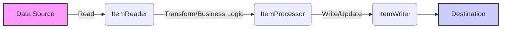

# Chapter 01: Introduction

## Overview
Ee chapter lo manam Spring Batch asalu enduku undi, adi em problem solve chestundi, and entha scale lo adi enterprise systems lo vadataaro chustamu. Spring Batch anedi oka lightweight mariyu comprehensive batch framework.

## Concept: Spring Batch
Spring Batch anedi automated, complex, inka large volumes of data ni user interaction lekunda process cheyadaniki vaade oka framework.
Idee scheduling framework (like Quartz, Control-M, Tivoli) kaadu. Spring Batch scheduler tho paatu kalisi pani chestundi kaani, scheduler ni replace cheyadu.

## Problem Solved
Spring Batch raకముందు (before Spring Batch), prati enterprise lo vaalla sontha (one-off, in-house) solutions ni raasukune vallu batch processing kosam. Daanivalla standard reusable architecture leka ibbandi ayyedi. SpringSource (now VMware) inka Accenture kalisi oka standard reusable batch processing framework tayaaru chesaaru. Ee framework valla infrastructure (logging, transaction management, restart, skip, resource management) antha Spring chusukuntundi, developers maatram business logic pina focus cheste chalu.

## When should we use it?
- Automated, complex large volume data ni user interaction lekunda process cheyali anukunnapudu.
- Month-end calculations, periodic interest calculations, or rate adjustments lanti recurring jobs kosam.
- External or internal systems nunchi vastunna raw data ni format, validate, and transactional way lo database (system of record) loki insert cheyadaniki.
- Manual or scheduled restart after a job failure.
- Sequential ga or massively parallel ga batch processing cheyali anukunte.

## When should we NOT use it?
- Real-time event-driven processing kosam (where low latency is critical). Spring Batch is meant for bulk processing, offline ga.
- Simple job scheduling kosam aithe just Quartz or Spring `@Scheduled` vaadukovachu, antha Spring Batch overhead avasaram ledu (unless transaction management and restartability kavali ante).

## Internal Working & Architecture Perspective
Spring Batch clear **separation of concerns** ni maintain chestundi.
- Infrastructure layer
- Batch execution environment layer
- Batch application layer

Prati core execution service (like execution, transaction, restart) ni interfaces gaa expose chestundi so that implement chesukovachu leda extend chesukovachu. "Out of the box" ga chala simple inka default implementations ni kuda istundi (e.g. flat files, database read/write).

## Execution Flow (Typical Batch Program)
Batch program execution mostly ee 3 steps lo untundi:
1. **Read:** Oka pedda amount of records ni database, file, leda queue nunchi read cheyadam.
2. **Process:** Aa read chesina data ni business logic apply chesi process (transform/modify) cheyadam.
3. **Write:** Process ayyina data ni modified form lo malli database leda inkoka system loki write cheyadam.

## Mermaid Diagram

## Enterprise Notes & Best Practices
### Real-world enterprise usage:
- Billions of transactions ni daily process chese financial institutions (like banks) end-of-day (EOD) processing ki Spring Batch vade vallu chala mandi unnaru.
- Massively parallel batch processing upayoginchi large datasets ni partition chesi multiple nodes medha process chestaru.

### Common developer mistakes:
- Spring Batch ni scheduler anukovadam. Job run cheyadaniki scheduler (like Jenkins, Control-M or Spring's own scheduling) avasaram padutundi. Spring Batch is meant for Job execution and tracking, not cron-triggering.

## Interview Questions
**Beginner:**
- Spring Batch enduku vadataaru?
- Spring Batch oka scheduler aa?

**Intermediate:**
- Spring Batch etuvanti business scenarios lo ekkuva vadataaru?
- "Read-Process-Write" iteration gurinchi explain cheyandi.

**Advanced:**
- Spring Batch architecture lo separation of concerns ela achieve chestaru?
- SpringSource and Accenture kalisi ee framework ni enduku tayaru cheyalsi vachindi?

## Summary
Ikkada manam Spring Batch asalu enduku vachindi, adi solve chese problems enti (standard reusable batch architecture), daani technical objectives inka typical scenarios gurinchi clear ga nerchukuntunnam. Framework will handle infrastructure, developers concentrate on business logic.