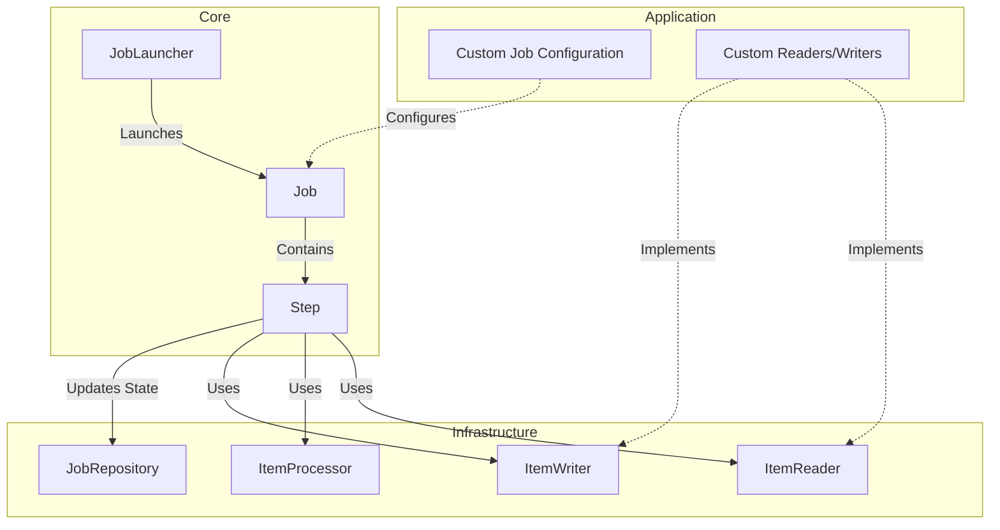
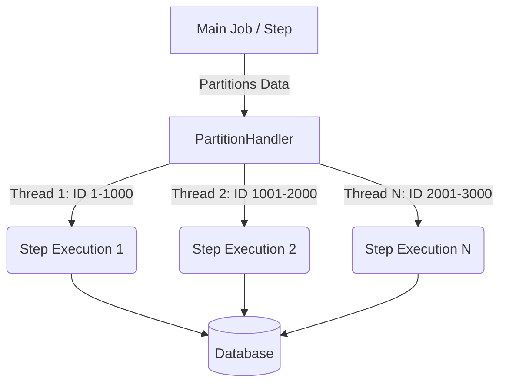

# Chapter 02: Spring Batch Architecture

## Overview
Spring Batch architecture design chaala clean ga, extend chesukune vidhanga (extensible) untundi. Developers valla own business logic raasukodaniki, infrastructure logic nunchi separate cheyadaniki idi design chesaru. Ee chapter lo manam Spring Batch architecture layers inka pedda pedda batch jobs run cheseppudu performance penchadaniki use chese techniques (like Partitioning) gurinchi nerchukuntamu.

## Architecture Layers (Separation of Concerns)

Spring Batch mainly 3 high-level layers ga divide ayyindi:

1. **Application Layer:**
   Ikkade manam raase actual code untundi. All custom batch jobs, custom item readers, processors, inka writers, manam iche configuration antha ee layer lo untundi.
2. **Core Layer:**
   Idi framework yokka gunde (heart) lanti layer. Batch domain ki sambandinchina classes anni ikkade untayi. Example: `Job`, `Step`, `JobLauncher`, `JobParameters`.
3. **Infrastructure Layer:**
   Paina unna Application inka Core layers ki kavalsina services ni ee layer isthundi. Common readers inka writers (like `FlatFileItemReader`, `JdbcCursorItemReader`), retry, inka execution infrastructure antha ikkada untundi.

## Execution Flow & Behind the Scenes

Batch processing lo main ga flow ila untundi: `JobLauncher` oka `Job` ni start chestundi. Aa `Job` lo okati leda aneka `Step` lu untayi. Prati `Step` lo malli Item Reader, Processor, inka Writer lu participate chesthayi. Ee execution details anni (job pass ayyinda, fail ayyinda, enni items process ayyayi) `JobRepository` dwara metadata tables lo save avuthayi.

## Mermaid Diagram: Spring Batch Architecture

## Scaling and Partitioning

Chala pedda data sets (millions/billions of records) ni process cheyali ante, single thread lo process cheste time chala ekkuva padutundi. Anduke Spring Batch lo **Partitioning** and **Parallel Processing** techniques unnayi.

### 1. What is Partitioning?
Partitioning ante oka pedda input data set ni chinna chinna mukkalu (partitions) ga vidadeesi, vatini concurrent ga (parallel ga) process cheyadam. Deeni valla batch job execution time chala taggutundi.

### 2. Partitioning Approaches
Data ni ela vidadiyali anedaniki konni approaches unnayi:

* **Fixed and Even Break-Up:** Data ni equal portions ga (e.g., 10 equal parts) divide cheyadam. Daaniki preprocessing overhead untundi (lower and upper bounds calculate cheyali).
* **Break up by a Key Column:** Oka primary key leda location code laanti key column based ga data range lu ivvadam (e.g., IDs 1-1000 oka partition, 1001-2000 inko partition). Idi chala common approach.
* **Breakup by Views:** Database level lo views create chesi, prati batch instance ki oka view ni assign cheyadam.
* **Addition of a Processing Indicator:** Table lo oka kotha column (e.g., `status='PENDING'`) petti, concurrent threads aa status ni update chesthu process cheyadam. Ikkada read cheseppudu locking (like `SELECT FOR UPDATE`) vaadali ledante multiple threads same record ni process chesthayi.
* **Extract Table to a Flat File:** Table data ni flat file ga extract chesi, aa file ni split chesi process cheyadam. (Idi koncham old fashion and IO intensive).
* **Use of a Hashing Column:** Mod_hash vadi records ni distribute cheyadam.

## Enterprise Notes & Database Implications

- **Minimizing Deadlocks:**
  Multiple threads leda multiple JVMs same table medha concurrent ga operations chestunnanpudu "Deadlocks" vache chance ekkuva. Database design deadlock prevention ni drushtilo pettukuni cheyali. Spring Batch lo administration tables (like `BATCH_JOB_EXECUTION`, `BATCH_STEP_EXECUTION`) medha kooda heavy concurrent updates jaruguthayi. Anduke transaction isolation levels ni proper ga configure chesukovali.

- **Wait-and-Retry:**
  Database deadlocks leda connection timeouts vachinappudu immediate ga job fail cheyakunda, retry mechanism (Wait-and-Retry) configure chesukovadam production lo chala mukhyam.

- **Parameter Validation:**
  Partition parameters pass chesetappudu gaps (data miss avvadam) leda overlaps (same data rendu sarlu process avvadam) lekunda validation cheyali.

## Important Interview Questions

**Beginner:**
- Spring Batch lo enni layers unnayi? (Application, Core, Infrastructure).
- `JobLauncher` and `JobRepository` ye layer kindaki vastayi?

**Intermediate:**
- Partitioning ante enti? Enduku vadataaru?
- Oka table lo records ni parallel ga process cheyali ante ye approach best? (Key Column or Processing Indicator).

**Advanced:**
- Parallel processing valla vache database deadlocks ni ela overcome chestaru?
- Spring Batch execution tables (JobRepository tables) meeda concurrent access jariginappudu row-level locks padathaya? Isolation level em vadali?

## Summary
Ee chapter lo manam Spring Batch architecture yokka layers gurinchi chusam. Application layer mana code ni hold chestundi, Core layer domain logic (Job/Step) ni handle chestundi, Infrastructure layer basic I/O and execution mechanisms ni provide chestundi. Alage pedda batch jobs ni fast ga run cheyadaniki vaade Partitioning approaches inka daani valla database deadlocks lanti issues ela vastayi, vatini ela handle cheyalo telusukunnam.
