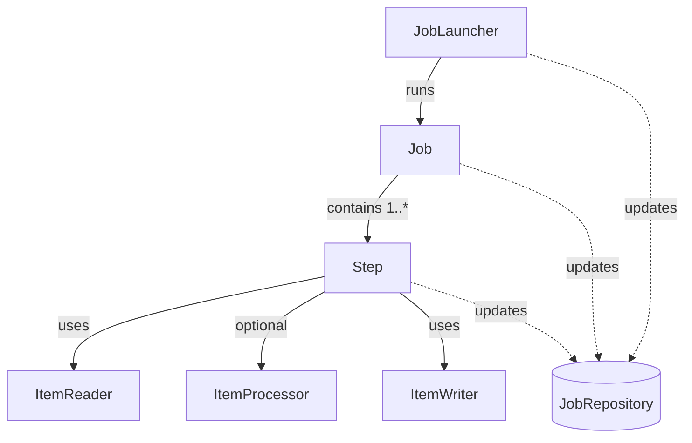

# Chapter 03: The Domain Language of Batch

## Overview
Ee chapter lo manam Spring Batch yokka Core Domain concepts gurinchi nerchukuntam. JCL leda COBOL background unna developers ki ee terms chala parichayam (familiar) ga untayi. Spring Batch lo oka job ela start avthundi, andulo components enti, vatini ela track chestaru anedi ikkada clear ga chooddam.

## Concept: Batch Stereotypes (The Building Blocks)

Spring Batch domain mainly kindi components (stereotypes) paina aadharapadi untundi:

1. **Job:** Oka poorthi batch process ni represent chese top-level component.
2. **Step:** `Job` lo oka individual phase leda sequential task.
3. **ItemReader:** Data source nunchi data ni read chese component.
4. **ItemProcessor:** Read chesina data meeda business logic apply chesi transform chese component.
5. **ItemWriter:** Process aina data ni destination (database/file/queue) ki raase (write) component.
6. **JobLauncher / JobOperator:** Job ni start leda control chese components.
7. **JobRepository:** Execution metadata (state, status) ni tables lo store chese repository.

## Mermaid Diagram: Batch Stereotypes



## Deep Dive into Job Concepts

### 1. Job
Oka `Job` anedi kevalam oka container matrame. Idi multiple `Step` లను hold chestundi.
- Job lo steps order (sequence) define chestaru.
- Job restartable aa kaada anedi configure chestaru.
- **Java Config Example:**
  ```java
  @Bean
  public Job footballJob(JobRepository jobRepository) {
      return new JobBuilder("footballJob", jobRepository)
                       .start(playerLoad())
                       .next(gameLoad())
                       .next(playerSummarization())
                       .build();
  }
  ```
- *Code Explanation:* Ikkada `JobBuilder` vaadi `footballJob` aney oka job ni create chestunnam. `start()` vaadi modati step, `next()` vaadi taruvatha steps ni chain chestunnam. Idivaruku XML configuration vaade vallu (`<job id="footballJob">...</job>`), kani ippudu ekkuva Java Config e vadtunnaru.

### 2. JobInstance
Idi chala crucial concept. `Job` anedi template aithe, `JobInstance` anedi daani oka "logical run".
- Example: "EndOfDay" anedi oka Job. Jan-01 naadu run cheste adi oka `JobInstance`. Jan-02 naadu run cheste adi inkoka `JobInstance`.
- Jan-01 job madyalo fail ayyi, repu malli ade Jan-01 data ki run cheste, kotha `JobInstance` create avvadu, **patha JobInstance ne vaaduthundi**. Deenini "Restart" antaru.

### 3. JobParameters
Oka `JobInstance` ni inkoka `JobInstance` nunchi ela differentiate chestaru? `JobParameters` dwara!
- Equation: `JobInstance = Job + identifying JobParameters`
- Jan-01 ki `date=01-01-2023` ani oka parameter, Jan-02 ki `date=01-02-2023` ani inko parameter pass chestaru.
- *Enterprise Note:* Anni parameters identity ki contribute cheyavu. Konni non-identifying parameters kuda pampochu (e.g., just for logging or dynamic paths).

### 4. JobExecution
`JobInstance` anedi logical run aithe, `JobExecution` anedi actual ga jarigina "physical attempt".
- Jan-01 `JobInstance` fail ayyindi anukondi. Idi Execution 1.
- Malli ade Job ni same Jan-01 parameters tho start chesthe, kotha `JobExecution` create avtundi, kaani adhe `JobInstance` ki link avtundi.
- `JobExecution` metadata tables lo chala important properties save chesukuntundi:
  - `status` (`STARTED`, `COMPLETED`, `FAILED`)
  - `startTime`, `endTime`, `createTime`, `lastUpdated`
  - `exitStatus`
  - `executionContext` (State nilava unchadaniki)

### 5. Step
Oka `Step` anedi independent phase. Oka complex Job ni multiple logical steps ga divide cheyochu.
- Oka step fail ayithe, daani varake restart cheyochu.
- **StepExecution:** `JobExecution` laga ne, prati step run ainappudu oka `StepExecution` create avtundi. Job fail ayithe, ye step daggara fail ayyindo tracking untundi.

### 6. ExecutionContext
Idi oka map/property bag lanti di (`Map<String, Object>`).
- State maintain cheyadaniki vaadutaru.
- Rendu rakalu:
  1. `JobExecution` level (Job antha data share chesukodaniki).
  2. `StepExecution` level (Step madyalo data kapadukovadaniki, e.g., "nenu 1000 records chadivanu" ani store chesthe, restart ainappudu 1001 nunchi start avvachu).
- *Performance/Transaction Note:* Ee context data prathi transaction commit ainappudu metadata tables (database) lo CLOB ga save avtundi. Anduke, pedda pedda objects leda lists ni ikkada store cheyakudadu, memory & DB serialization issues vastayi.

### 7. JobRepository
Idi Spring Batch yokka C.R.U.D interface.
- Prathi Job, Step start ainappudu, fail ainappudu, state maarutunnapudu ee repository velli DataBase tables (`BATCH_JOB_INSTANCE`, `BATCH_JOB_EXECUTION`, `BATCH_STEP_EXECUTION` etc.) update chestundi.

## Important Interview Questions

**Beginner:**
- `Job`, `Step` madyalo relationship enti?
- `ItemReader`, `ItemProcessor`, `ItemWriter` roles enti?

**Intermediate:**
- `JobInstance` inka `JobExecution` madyalo theda (difference) enti?
- Restart chesinappudu kotha `JobInstance` create avtunda leda `JobExecution` create avtunda? (Answer: Kotha `JobExecution` create avtundi).

**Advanced:**
- Job parameters iddariki (two instances) same isthe emavtundi? (Answer: Spring Batch exception visuruthundi: "JobInstance already exists" antoo, unless patha instance failed state lo undi restart ki try chestunte).
- `ExecutionContext` ni database lo eppudu persist chestaru? Andulo large objects pedithe emavtundi?

## Summary
Ee chapter lo Spring Batch yokka mukhyamaina domain terms (stereotypes) nerchukuntam. Job anedi oka flow, andulo multiple Steps untayi. Data chadivadaniki Reader, process cheyadaniki Processor, rayadaniki Writer vaadatam chusam. Asalu Batch state ela nilabettukuntundo (ExecutionContext) inka database lo ela record avtundo (JobRepository, JobExecution) detail ga choosam.
