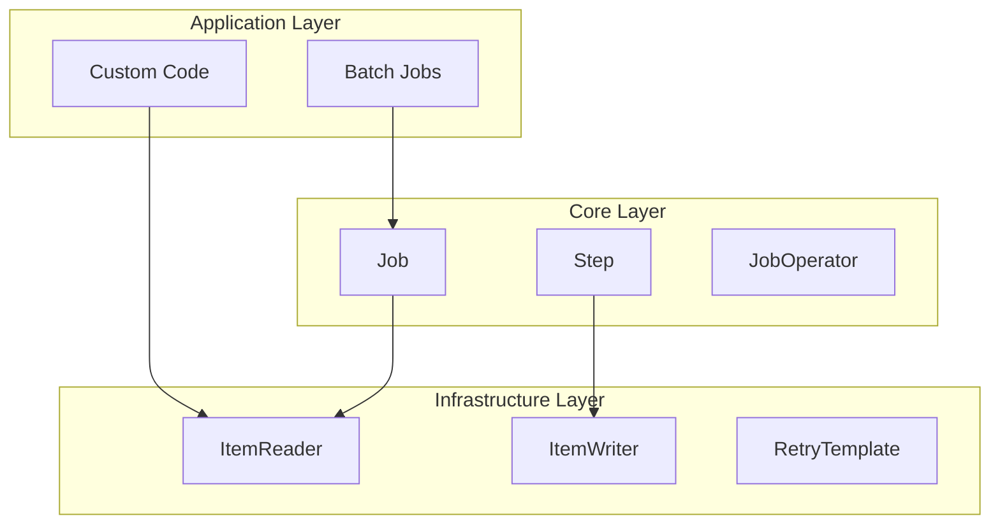

# Chapter 03 - Spring Batch Architecture

## Introduction
Spring Batch architecture anedi extensibility ni inka diverse end users ni drushtilo pettukuni design cheyabaddadi. Ee chapter lo manam Spring Batch yokka layered architecture, general batch principles, mariyu batch processing strategies gurinchi in-depth ga nerchukuntamu.

## Layered Architecture
Spring Batch yokka architecture mukhya maina 3 layers ga divide aiyyi untundi:

1. **Application Layer:** Developers rase custom code (batch jobs, business logic, configuration) antha ikkade untundi. Idi core mariyu infrastructure layers paina build cheyabadutundi.
2. **Core Layer:** Oka batch job ni launch cheyadaniki inka control cheyadaniki kavalasina runtime classes anni (Job, Step, JobOperator) ee layer lo untayi.
3. **Infrastructure Layer:** Application mariyu Core layers ki common ga kavalasina services anni ikkada untayi. Ee layer lo `ItemReader`, `ItemWriter`, `RetryTemplate` lanti reusable components untayi.

### Architecture Diagram

## General Batch Principles & Guidelines
Oka batch solution ni design chesetappudu konni mukhyamaina guidelines follow avvali:
- **Simplify:** Batch applications lo complex logical structures ni avoid cheyali. Simple ga unte maintain cheyadam easy.
- **Data & Processing Proximity:** Data ekkada undo processing akkade jargali. Deeni valla network latency taggutundi.
- **Minimize I/O:** Disk I/O (database queries or file reads) ni entha tagginchagaligite antha tagginchali. In-memory operations (caching) ni prefer cheyali. Unnecessary table scans leda key-less `WHERE` clauses vadakudadu.
- **Do not repeat:** Oka data ni summarize chesaka, daanni store chesukuni vere reporting applications ki ivali gani, malli malli same process cheyakudadu.
- **Memory Allocation:** Memory ni start lone allocate chesukovali, madhyalo reallocation valla time waste avtundi.
- **Data Integrity:** Epatikappudu checks inka validations pettukovali. Flat files ki trailer records (record count, checksum) undali.
- **Testing:** Realistic data volumes tho production-like environment lo stress testing twaraga cheyali.
- **Backups:** Database backups elago vuntayi, kani flat file backups kuda batch processing lo chala mukhyam.

## Batch Processing Strategies
Batch applications ni design cheyadaniki konni standard building blocks untayi:
- **Conversion Applications:** External system nunchi vachina data format ni standard format ki convert cheyadam.
- **Validation Applications:** Input data (headers, trailers, checksums) correct ga undo ledo validate cheyadam.
- **Extract Applications:** Database or file nunchi rules base cheskuni records read chesi inkoka file ki rayadam.
- **Extract/Update Applications:** Records read chesi daani prakaram database ni update cheyadam.
- **Processing & Updating Applications:** Business logic apply chesi, db nunchi information thechukuni malli update cheyadam.
- **Output/Format Applications:** Data ni oka standard format ki marchi vere system ki pampadam (or print cheyadam).

**Utility Steps:**
- Sort: Records ni re-sequence cheyadam.
- Split: Oka pedda file ni multiple files ga divide cheyadam.
- Merge: Multiple files ni kalipi oka file ga thestundi.

## Concurrency and Locking Options
Enterprise batch processing eppudu offline lone kadu, online transactions jargutunappudu kuda parallel ga jargochu. Appudu locking strategy chala mukhyam.

1. **Normal Processing in Batch Window:** Online users evaru data ni access cheyanappudu, batch mottaniki oke commit ivvochu (but usually not recommended as data grows).
2. **Concurrent Batch or On-line Processing:** Online users tho paatu batch run avtunte, data meeda ekuva sepu lock pettakudadu. Commit every few transactions ki avvali. Ikkada logical row-level locking (Optimistic or Pessimistic) vaadali.
   - *Optimistic Locking:* Record modify chese mundu timestamp or version check chestundi. Collision chances thakkuva unnapudu vadutaru.
   - *Pessimistic Locking:* Record read chesinapude lock (physical or logical flag) pedthundi. Contention chances ekuva unnapudu idi better.
3. **Parallel Processing:** Multiple batch jobs oke sari run avvadam. Vaati madhya data sharing unte conflicts rakunda control tables maintain cheyali.
4. **Partitioning:** Oka pedda batch job ni chala pieces (partitions) ga viadagotti oke sari multiple threads lo run cheyadam. Ee method valla processing time chala taggutundi.

### Partitioning Approaches
- Fixed and Even Break-Up of Record Set (1/10th of records each).
- Break up by a Key Column (e.g., location id based).
- Breakup by Views (Database views vaadi split cheyadam).
- Addition of a Processing Indicator (Table lo oka flag add cheyadam `not-processed`, `processing`, `completed`).
- Extract Table to a Flat File and split.
- Use of a Hashing Column (e.g., A, B, C indicators for different instances).

## Minimizing Deadlocks
Parallel processing or partitioning chesetapudu database deadlocks vache chance ekuva. DBA support tho table indexes inka architecture tables ni optimize cheyali. Deadlock vaste ventane fail avvakunda, koncham sepu aagi malli retry chese (wait-and-retry) logic ni implement cheyali.

## Behind the Scenes: Infrastructure and Parallelism
- **Component Interplay**: Application layer code references the Core layer (like `Job` and `Step`). Both Application and Core rely heavily on the Infrastructure layer (readers, writers, templates).
- **Physical vs Logical Partitioning**: Database partitioning strategy must align with application partitioning. Using a central "Partition Repository" (Partition Table) with High and Low key values is a production best practice for managing data bounds dynamically at startup.
- **Handling Contention**: Locking services or wait-and-retry logic should be implemented natively in the architecture to prevent full job aborts due to temporary database locks.

## Interview Questions
1. **Spring Batch Layered Architecture lo emem untayi?**
   - Application Layer (Job definitions/Custom code), Core Layer (Job, Step, JobOperator), Infrastructure Layer (ItemReader, ItemWriter, RetryTemplate).
2. **Optimistic Locking mariyu Pessimistic locking ki theda enti batch processing lo?**
   - Optimistic locking record modify chese tapudu version/timestamp check chestundi, idi contention thakkuva unnapudu vadataru. Pessimistic read chese tapude lock pedthundi, idi conflicts ekuva unnappudu (batch jobs lo ekuvaga) vadataru.
3. **Partitioning ante enti, Batch lo idi enduku vadataru?**
   - Partitioning ante oka pedda dataset ni chinna chinna mukkalu ga (partitions) viadagotti, vaatini oke sari parallel ga process cheyadam. Deeni valla total batch time chala thaggutundi.

## Summary
Spring Batch Layered Architecture (Application, Core, Infrastructure) anedi clear separation of concerns ni isthundi. Manchi batch application rayalante I/O minimize cheyadam, in-memory operations vadadam, inka locking meeda pattu undadam chala avasaram. Partitioning inka parallel processing techniques vaadi performance ni maximize chesukovachu.
## 4. Layered Architecture Deep Dive
Spring Batch architecture 3 layers ga untundi:
- **Application**: Developers rase code inka job configurations.
- **Core**: Job, Step, JobLauncher lanti classes. Ivi batch domain ni represent chesthayi.
- **Infrastructure**: ItemReaders, ItemWriters, mariyu JobRepository. Ivi actual ga data tho interact ayye components.
