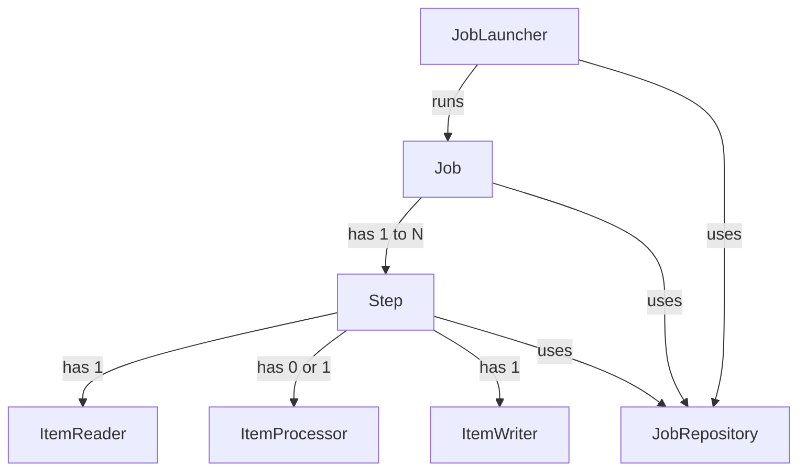
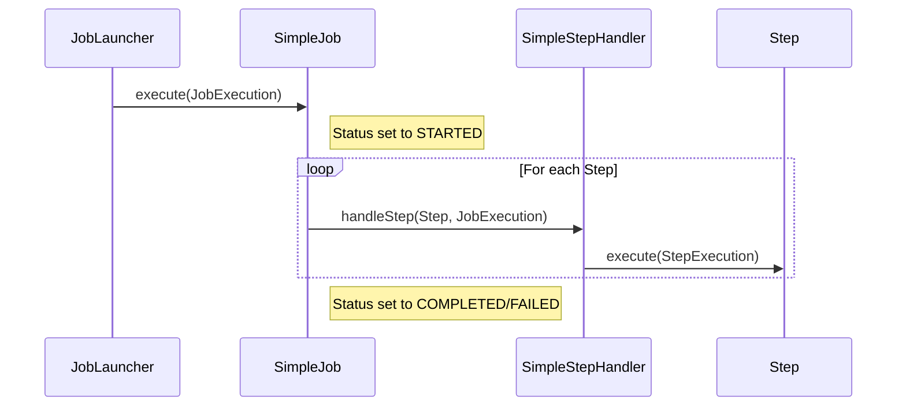
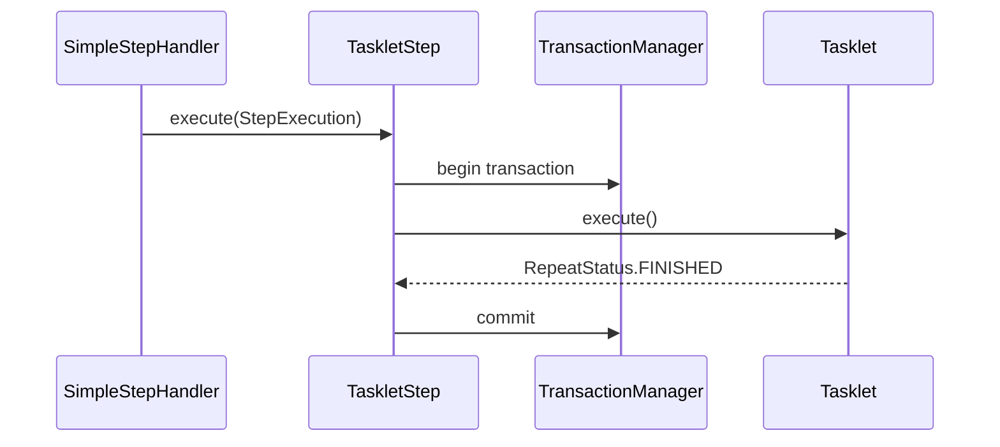

# Chapter 04 - The Domain Language of Batch

## Introduction
Prathi experienced batch architect ki Spring Batch lo unde overall concepts (Job, Step, ItemReader, ItemWriter) munde parichayam unnavi gaane untayi. Kaani, Spring patterns, templates, callbacks, inka idiomatic Java upayoginchadam valla, Spring Batch lo separation of concerns chaala clear ga untundi. Ee chapter lo manam Spring Batch yokka domain language (Core Entities) gurinchi in-depth ga nerchukuntamu.

## Domain Concept Stereotypes Diagram



---

## 1. Job

Oka `Job` anedi poorthi batch process ni encapsulate chese oka container. Idi just oka blueprint (leda definition). Deenilo Job peru, Steps order, inka restartability details untayi.

### Behind the Scenes: Job
*   **Package Name:** `org.springframework.batch.core.Job`
*   **Default Implementation:** `org.springframework.batch.core.job.SimpleJob`
*   **Important Methods:** `execute(JobExecution execution)`, `getName()`, `isRestartable()`
*   **Who calls it internally:** `org.springframework.batch.core.launch.support.SimpleJobLauncher`
*   **What it calls next:** `SimpleStepHandler.handleStep()` (to execute individual steps)
*   **Lifecycle:** JobLauncher nunchi call vachinappudu `execute()` invoke avtundi. Job start ayyemundu `JobExecution` status `STARTED` ga marthundi. Lopalunna steps anni complete ayyaka `COMPLETED` leda `FAILED` ga marthundi.



---

## 2. JobInstance & JobParameters
`JobInstance` anedi oka logical job run ni represent chestundi. `Job` anedi blueprint aithe, `JobInstance` anedi aa blueprint tho eeroju run chese pani. Ee `JobInstance` inkoka daaniki theda theliyalante `JobParameters` vadatharu.

*   **Package Name:** `org.springframework.batch.core.JobInstance`, `org.springframework.batch.core.JobParameters`

```
JobInstance = Job + Identifying JobParameters
```

---

## 3. JobExecution
`JobExecution` anedi oka `Job` ni run cheyadaniki chese single attempt (technical concept). Oka `JobInstance` complete ayyela cheyadaniki multiple `JobExecution`s jaragavachu (due to failures and restarts).

### API Insights: `JobExecution` Properties
*   **Package Name:** `org.springframework.batch.core.JobExecution`
*   `status` (`BatchStatus`): STARTED, FAILED, COMPLETED.
*   `startTime`, `endTime`, `createTime`, `lastUpdated` (`LocalDateTime`).
*   `exitStatus` (`ExitStatus`): Caller ki return iche exit code.
*   `executionContext` (`ExecutionContext`): State maintain cheyadaniki.

---

## 4. Step

`Step` anedi job lo oka independent, sequential phase. Idi simple script execution kavachu leda complex chunk-based data processing kavachu.

### Behind the Scenes: Step
*   **Package Name:** `org.springframework.batch.core.Step`
*   **Default Implementation:** `org.springframework.batch.core.step.tasklet.TaskletStep`
*   **Important Methods:** `execute(StepExecution stepExecution)`
*   **Who calls it internally:** `SimpleStepHandler` (from `SimpleJob`)
*   **What it calls next:** `Tasklet.execute()` (or specifically `ChunkOrientedTasklet.execute()`)
*   **Lifecycle:** Step start avagane kotha `StepExecution` create avtundi. Transaction boundary lona chunk processing leda tasklet logic jargutundi. Success aithe `COMPLETED`, leda `FAILED` ga mark avtundi.



---

## 5. ExecutionContext

`ExecutionContext` anedi framework dvara control cheyabade key/value pairs collection. Deeni main purpose: Job fail ayina tarvata restart chesetappudu "state" ni save cheyadam.

### Behind the Scenes: ExecutionContext
*   **Package Name:** `org.springframework.batch.item.ExecutionContext`
*   **Default Implementation:** Backed by a `ConcurrentHashMap<String, Object>`
*   **Important Methods:** `put(String key, Object value)`, `getInt()`, `getString()`
*   **Who calls it internally:** `ItemStream` implement chese components (e.g. `FlatFileItemReader`)
*   **What it calls next:** Framework calls `JobRepository.updateExecutionContext()` to persist to DB.
*   **Lifecycle:** Step level context ayithe prathi commit interval ki save avtundi. Job level context ayithe step nunchi step madhyalo save avtundi. Objects anni thappakunda `Serializable` ayyi undali.

---

## 6. JobRepository

`JobRepository` anedi metadata antha save chese persistence layer.

### Behind the Scenes: JobRepository
*   **Package Name:** `org.springframework.batch.core.repository.JobRepository`
*   **Default Implementation:** `org.springframework.batch.core.repository.support.SimpleJobRepository`
*   **Important Methods:** `createJobExecution()`, `update()`, `updateExecutionContext()`
*   **Who calls it internally:** `JobLauncher`, `Job`, `Step`
*   **What it calls next:** Internal `Dao` classes (`JobInstanceDao`, `JobExecutionDao`, `StepExecutionDao`) which execute SQL against the database.
*   **Lifecycle:** Application start nunchi end varaku idi eppudu actively transactions vadi metadata (started, updated, completed states) ni BATCH_* tables lo persist chesthune untundi.

---


## 7. JobOperator
`JobOperator` anedi job lifecycle ni control chese (start, stop, restart, abandon) ok simple interface.

### Behind the Scenes: JobOperator
*   **Package Name:** `org.springframework.batch.core.launch.JobOperator`
*   **Default Implementation:** `org.springframework.batch.core.launch.support.SimpleJobOperator`
*   **Important Methods:** `start()`, `stop()`, `restart()`, `abandon()`
*   **Who calls it internally:** External clients like REST controllers or JMX beans or Schedulers call this to interact with batch jobs gracefully.

## 8. ItemReader, ItemProcessor, and ItemWriter
*   **ItemReader**: Reads data one item at a time. Returns `null` when exhausted.
*   **ItemProcessor**: Transforms data. Returns `null` to filter an item.
*   **ItemWriter**: Takes a chunk (List) of items and writes them sequentially or in batch.

*(These are discussed deeply in later chapters).*

## Interview Questions

1. **JobInstance mariyu JobExecution ki madhya theda enti?**
   - `JobInstance` anedi logical job run (Job + Parameters), kani `JobExecution` anedi actual attempt. Oka fail ayina `JobInstance` ki multiple `JobExecution`s undochu, kani successful `JobInstance` complete ayyindi anede final.
2. **ExecutionContext asalu em chestundi?**
   - Idi oka key-value store, framework idhi prathi commit ki DB lo save chestundi. Fail aina execution ni malla start (restart) cheyadaniki state maintain cheyadaniki idi chala avasaram.
3. **Oka Job ni same JobParameters tho roju run cheyyocha?**
   - Ledu. Oka `JobInstance` already COMPLETED state lo unte, same JobParameters tho malli run cheyaleru (`JobInstanceAlreadyCompleteException` vastundi). Roju run cheyali ante timestamp lanti param ni add chesi new instance thecchukovali.

## Summary
Ee chapter lo Spring Batch domain language loni major components (`Job`, `Step`, `ExecutionContext`, `JobRepository`) yokka internal implementations, package names, inka call sequences gurinchi clear ga nerchukunnnamu. Ee internal knowledge debugging time lo chala help avtundi.
