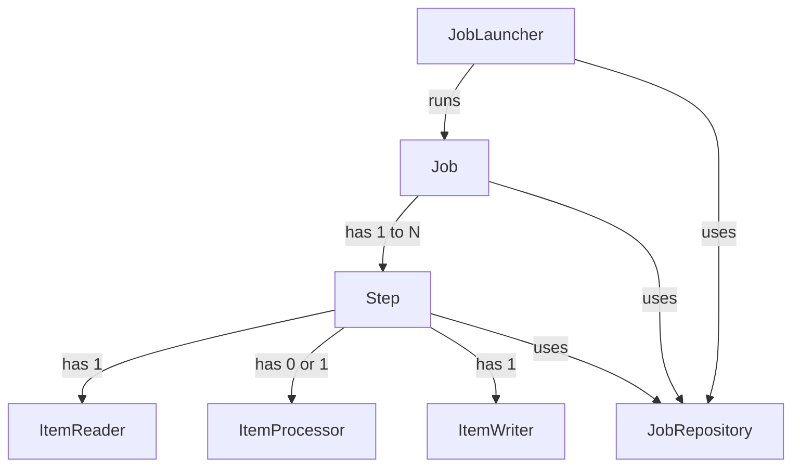

# Chapter 04 - The Domain Language of Batch

## Introduction
Prathi experienced batch architect ki Spring Batch lo unde overall concepts (Job, Step, ItemReader, ItemWriter) munde parichayam unnavi gaane untayi. Kaani, Spring patterns, templates, callbacks, inka idiomatic Java upayoginchadam valla, Spring Batch lo separation of concerns chaala clear ga untundi. Ee chapter lo manam Spring Batch yokka domain language (Core Entities) gurinchi in-depth ga nerchukuntamu. Ee stereotypes meeda pattunte, framework ni artham cheskovadam chala easy.

## Domain Concept Stereotypes Diagram



Paina unna diagram lo mukhya maina batch stereotypes unnayi. Oka `Job` lo okati leda antha kante ekkuva `Step`s untayi. Prathi `Step` lo `ItemReader`, optional ga `ItemProcessor`, inka `ItemWriter` untayi. `Job` ni launch cheyadaniki `JobLauncher` (leda `JobOperator`) vadataru, mariyu execution metadata antha `JobRepository` lo store inka restore avtundi.

---

## The `Job` Entity

Oka `Job` anedi poorthi batch process ni encapsulate chese oka container. Idi just oka blueprint (leda definition). Deenilo ee kindi details untayi:
- Job yokka peru (name)
- Etuvanti `Step`s unnayi inka vaati execution order enti
- Ee job restartable aa kaada?

Java configuration lo, Spring Batch `SimpleJob` ane default implementation istundi, kani manam vaadedi `JobBuilder`.

### Code Example: Job Configuration
```java
@Bean
public Job footballJob(JobRepository jobRepository) {
    return new JobBuilder("footballJob", jobRepository)
                     .start(playerLoad())
                     .next(gameLoad())
                     .next(playerSummarization())
                     .build();
}
```

---

## `JobInstance`
`JobInstance` anedi oka logical job run ni represent chestundi. `Job` anedi blueprint aithe, `JobInstance` anedi aa blueprint tho eeroju run chese pani.
*Example:* Oka 'EndOfDay' `Job` roju ratri run avvali. Jan 1st roju run ayye job 'Jan 1st JobInstance'. Oka vela Jan 1st run fail ayyi, malli next day re-run chesina... adi kotha `JobInstance` kaadu, same 'Jan 1st JobInstance' ee.

**Important:** Oka specific time lo oke `JobInstance` (identified by JobParameters) run avvalagadu.

---

## `JobParameters`
Oka `JobInstance` inkoka `JobInstance` ki madyalo theda etla thelustundi? Answer: `JobParameters`.
`JobParameters` anedi oka batch job ni start cheyadaniki vaade parameters set.

```
JobInstance = Job + Identifying JobParameters
```
*Behind the scenes:* Me data load logic lo elanti data load avvalo (e.g. effective date based) ee `JobParameters` dwara pass chestaru.

---

## `JobExecution`
`JobExecution` anedi oka `Job` ni run cheyadaniki chese single attempt (technical concept). Oka `JobInstance` complete ayyela cheyadaniki multiple `JobExecution`s jaragavachu.
*Example:* Jan 1st `JobInstance` fail aithe adi oka `JobExecution` (Failed status). Malli same Jan 1st parameters tho restart cheste inkoka kotha `JobExecution` create avtundi, kani `JobInstance` maatram okkate.

### API Insights: `JobExecution` Properties
`JobExecution` object lo chala mukhyamaina properties untayi:
- `status` (`BatchStatus`): STARTED, FAILED, COMPLETED.
- `startTime`, `endTime`, `createTime`, `lastUpdated` (`LocalDateTime`).
- `exitStatus` (`ExitStatus`): Caller ki return iche exit code.
- `executionContext` (`ExecutionContext`): Ee execution nunchi inko execution ki datani save cheskovadaniki property bag.

*Behind the scenes:* Metadata tables like `BATCH_JOB_EXECUTION` lo ee data antha save avtundi, deeni vallane Spring Batch ki fail ayina deggara nunchi "restart" chese capability vasthundi.

---

## `Step`
`Step` anedi job lo oka independent, sequential phase. Prathi `Job` konni `Step`s tho form avtundi. Oka `Step` chala simple (just reading and writing) leda chala complex (complex business rules applying) undochu.

## `StepExecution`
`JobExecution` laagaane, `StepExecution` anedi oka `Step` ni run cheyadaniki chese attempt. `JobExecution` start aithene `StepExecution` create avtundi. Mundu step fail aithe, tharwata step ki execution create avvadu.

### API Insights: `StepExecution` Properties
- `readCount`, `writeCount`: Enni records read/write ayyayo chepthayi.
- `commitCount`, `rollbackCount`: Transactional statistics.
- `readSkipCount`, `writeSkipCount`, `processSkipCount`: Skip logic dwara ignore chesina records count.
- `filterCount`: `ItemProcessor` lo null return chesi filter aina records count.

---

## `ExecutionContext`
`ExecutionContext` anedi framework dvara control cheyabade key/value pairs collection (similar to Quartz `JobDataMap`). Deeni main purpose: Job fail ayina tarvata restart chesetappudu "state" ni save cheyadam.

*How it works internally:* Flat file processing lanti scenarios lo, prathi commit time lo, framework `ExecutionContext` ni database lo save chestundi. E.g., 40,000 lines tarvata fail aithe, a `lineCount` variable context lo untundi. Restart chesinapudu, `ItemReader` aa count ni teeskuni 40,001 line nunchi start avtundi.

**Best Practice / Warning:**
- Oka Job ki oka `ExecutionContext`, inka prathi Step ki daani sontha `ExecutionContext` untundi (`ecStep != ecJob`).
- Ee context lo pedthunna objects anni thappakunda `Serializable` ayyi undali. Leda restart time lo deserialize avvaka fail avtundi.

---

## JobRepository & JobOperator
- **JobRepository:** Idivaraku cheppina `Job`, `Step`, `Executions` annitini save chese persistence mechanism. Idhi database lo `BATCH_` tables dwara CRUD operations chestundi.
- **JobOperator:** Jobs ni start, stop, leda restart cheyadaniki use ayye simple interface. Custom dashboards leda REST controllers nunchi job ni control cheyali ante deenni vadutaru.

## The Trio: ItemReader, ItemProcessor, ItemWriter
- **ItemReader:** Oka time lo okko item ni input nunchi (file, DB, queue) chadavadaniki (Retrieval of input). Anni items aipoyaka `null` return chestundi.
- **ItemProcessor:** Business logic / Transformation apply cheyadaniki. Item ni invalid ani reject cheyali anukunte, ikkadanunchi `null` return chestaru (adi write avvadu).
- **ItemWriter:** Oka time lo oka chunk/batch (List of items) ni destination loki (DB, file) write chestundi. Deeniki previous leda next items tho sambandam undadu.

---

## Interview Questions

1. **JobInstance mariyu JobExecution ki madhya theda enti?**
   - `JobInstance` anedi logical job run (Job + Parameters), kani `JobExecution` anedi actual attempt. Oka fail ayina `JobInstance` ki multiple `JobExecution`s undochu, kani successful `JobInstance` complete ayyindi anede final.
2. **ExecutionContext asalu em chestundi?**
   - Idi oka key-value store, framework idhi prathi commit ki DB lo save chestundi. Fail aina execution ni malla start (restart) cheyadaniki state maintain cheyadaniki idi chala avasaram.
3. **ItemProcessor lo nunchi `null` return cheste em avtundi?**
   - Aa item filter ayipothundi, adhi `ItemWriter` ki velladu. Deenni filtering pattern antaru, inka idi `StepExecution` yokka `filterCount` lo add avtundi.
4. **Oka Job ni same JobParameters tho roju run cheyyocha?**
   - Ledu. Oka `JobInstance` already COMPLETED state lo unte, same JobParameters tho malli run cheyaleru (`JobInstanceAlreadyCompleteException` vastundi). Roju run cheyali ante timestamp lanti param ni add chesi new instance thecchukovali.

## Summary
Ee chapter lo Spring Batch domain language lo prathi technical concept (Job, Step, Reader, Processor, Writer, Execution, Context) venuka unna reasoning mariyu database representations gurinchi clearly nerchukuntamu. Ee stereotypes meeda deep understanding thone framework chala parmatmaga avuthundi.