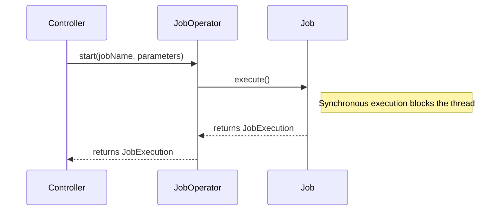

# Chapter 05 - Configuring and Running a Job

## Introduction
Mundu chapters lo manam `Job` anedi Steps ki oka container ani, `JobRepository` metadata store chestundani nerchukunnnamu. Ee chapter lo, aa `Job` ni elaa configure cheyyali, `JobRepository` ni ela setup cheyyali, command line nunchi leda web container nunchi aa `Job` ni elaa run cheyyali anedi deep ga chusthamu.

## 1. Batch Infrastructure Configuration

Spring Batch job run avvalante `JobOperator`, `JobRepository` lanti infrastructure beans kachithanga undali. Vaatini manual ga define chese badulu, Spring Batch `@EnableBatchProcessing` leda `DefaultBatchConfiguration` ni isthundi.

**Behind the scenes:** Default ga Spring Batch 6.0 `ResourcelessJobRepository` ni vaduthundi (in-memory DB avasaram lekunda). Idi job metadata ni persist cheyyadu, kabatti state share chesukune partitions ki leda restartability ki idi panikiradu.

```java
@Configuration
@EnableBatchProcessing
public class MyJobConfiguration {
    @Bean
    public Job job(JobRepository jobRepository) {
        return new JobBuilder("myJob", jobRepository)
            // define job flow as needed
            .build();
    }
}
```

## 2. Configuring a Job
Oka Job ni configure cheyadaniki `JobBuilder` ni vaadathamu. Job ki thappakunda peru inka `JobRepository` ivvali.

### Restartability
Oka vela Job run avthu fail ayithe, daani malli start cheyyadam "restart" anipinchukuntundi. Konni scenarios lo manam okkasari fail aina job ni malli run cheyyanivvakudadu anukuntam. Appudu `preventRestart()` vadali.

```java
@Bean
public Job footballJob(JobRepository jobRepository) {
    return new JobBuilder("footballJob", jobRepository)
                     .preventRestart() // restartable = false
                     .build();
}
```
*API Insight:* Restartable `false` unna job ni malli launch cheyadaniki try chesthe `JobRestartException` vastundi.

### Intercepting Job Execution
Job start ayye mundu, leda end ayyina taruvatha emaina custom logic (like email notifications) run cheyali anukunte `JobExecutionListener` vadali (`@BeforeJob` & `@AfterJob` annotations kuda unnay).

```java
public void afterJob(JobExecution jobExecution) {
    if (jobExecution.getStatus() == BatchStatus.COMPLETED) {
        // Success custom logic
    } else if (jobExecution.getStatus() == BatchStatus.FAILED) {
        // Failure notification logic
    }
}
```

### JobParametersValidator
Job start ayyetappudu pass chese parameters correct ga unnaya leda ani check cheyyadaniki `DefaultJobParametersValidator` leda custom validator vadukovachu. Idi job build chesetapude `.validator(...)` dwara configure cheyochu.

## 3. Configuring a JobRepository
JobRepository is the heart of Spring Batch persistence. Restartability kavali ante, DB backed job repository vundali.

- JDBC kosam: `@EnableJdbcJobRepository`
- Mongo kosam: `@EnableMongoJobRepository`

```java
@Configuration
@EnableBatchProcessing
@EnableJdbcJobRepository(
    dataSourceRef = "batchDataSource",
    transactionManagerRef = "batchTransactionManager",
    tablePrefix = "SYSTEM.TEST_",
    isolationLevelForCreate = "ISOLATION_REPEATABLE_READ"
)
public class MyJobConfiguration { ... }
```
*Enterprise Note:* Ekuva concurrent jobs launch avthunte default isolation level `SERIALIZABLE` untundi, adi konni sarlu deadlocks ki daari theeyochu. Alanti cases lo `ISOLATION_REPEATABLE_READ` or `READ_COMMITTED` best.

## 4. Configuring a JobOperator
`JobOperator` anedi job ni start, stop, restart cheyadaniki oka simple interface. `TaskExecutorJobOperator` anedi deeniki basic implementation.



**Asynchronous Execution:**
Oka vela HTTP request nunchi job start chestunte, job chala sepu run avthundi kabatti HTTP thread block avvakudadu. Appudu `JobOperatorFactoryBean` ki `SimpleAsyncTaskExecutor` set cheyali.

## 5. Running a Job

### From Command Line
Schedulers (like Control-M, cron) nunchi Java job run cheyadaniki `CommandLineJobOperator` (used to be CommandLineJobRunner) vadatharu. Idi context load chesi, arguments ni `JobParameters` ga marchi, job ni launch chestundi.

```bash
java CommandLineJobOperator io.spring.EndOfDayJobConfiguration start endOfDay schedule.date=2007-05-05,java.time.LocalDate,true
```
*(Ikkada `true` ante adi identifying parameter ani artham).*

Exit Codes:
CommandLineJobOperator `ExitCodeMapper` ni vadi Job yokka string exit code (e.g. COMPLETED) ni OS ki arthamayye integer (0, 1, 2) ga marustundi.

### From Web Container (REST)
MVC controller or REST API nunchi start chesthunte `JobOperator` autowire cheskuni `jobOperator.start(...)` call cheyyali. (Paina cheppinattu Async task executor vadali).

## 6. Advanced Metadata Usage

### JobParametersIncrementer
Roju run ayye job ni schedule chesinappudu, parameters same unte `JobInstanceAlreadyCompleteException` vastundi. Alaanti case lo `startNextInstance` method vadali. Idi Job ki tagilinchina `JobParametersIncrementer` (e.g. `run.id` ni +1 cheyyadam) vaadi kotha parameter tho kotha job instance ni thestundi.

### Stopping, Recovering, and Aborting Jobs
- **Stop:** `jobOperator.stop(executionId)`. Idi ventane aagipodu. Control Spring Batch ki vachinapudu `BatchStatus.STOPPED` set chestundi.
- **Recovering:** JVM sudden ga crash aithe DB lo state "STARTED" gaane untundi. Appudu `jobOperator.recover(execution)` vadi state fix chesi restart cheyochu.
- **Aborting:** Job fail ayyindi kani malli restart cheyyanakkarledu anukunte, status ni manually `ABANDONED` ga set cheyali.

## Interview Questions
1. **`@EnableBatchProcessing` default ga etuvanti JobRepository isthundi?**
   - V6 nunchi idi `ResourcelessJobRepository` isthundi. Idi in-memory state matrame pedthundi, DB save cheyyadu, restartability ki panikiradu. DB kavali ante `@EnableJdbcJobRepository` vadali.
2. **REST API nunchi batch job start cheyali ante elanti jagrathalu theskovali?**
   - Web thread block avvakunda `JobOperator` ni Asynchronous ga (`TaskExecutor` vadi) configure cheyyali.
3. **`JobParametersIncrementer` enduku vaadatharu?**
   - Same job ni repeatedly start chese tapudu, previous JobParameter state nunchi kotha identifying parameter create cheyadaniki vadatharu.

## Summary
Ee chapter lo manam job configuration inka execution venuka unna mechanisms nerchukunnnamu. Infrastructure beans (JobRepository, JobOperator) ela pani chesthayo, Web inka CLI nunchi elaa jobs theskovalo chusamu. Next chapter lo `Step` configuration (chunk processing, skip, retry) gurinchi telusukundam.