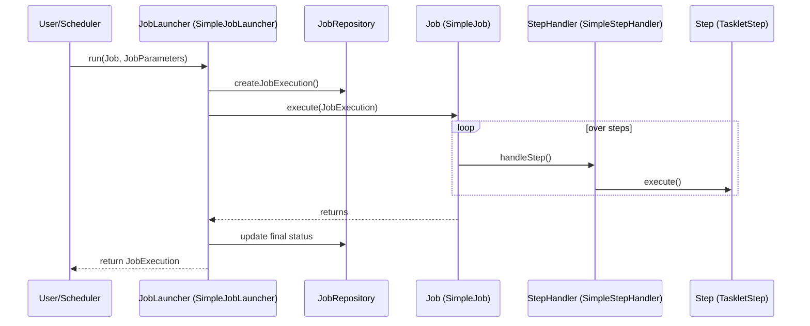

# Chapter 05 - Configuring and Running a Job

## Introduction
Mundu chapters lo manam `Job` anedi Steps ki oka container ani, `JobRepository` metadata store chestundani nerchukunnnamu. Ee chapter lo, aa `Job` ni elaa configure cheyyali, `JobRepository` ni ela setup cheyyali, command line nunchi leda web container nunchi aa `Job` ni elaa run cheyyali anedi deep ga chusthamu.

## 1. Batch Infrastructure Configuration

Spring Batch job run avvalante `JobLauncher`/`JobOperator` mariyu `JobRepository` lanti infrastructure beans kachithanga undali. Vaatini manual ga define chese badulu, Spring Batch `@EnableBatchProcessing` leda `DefaultBatchConfiguration` ni isthundi.

**Default Behavior:** Default ga Spring Batch 6.0 `ResourcelessJobRepository` ni vaduthundi. Idi job metadata ni persist cheyyadu, kabatti state share chesukune partitions ki leda restartability ki idi panikiradu.

```java
@Configuration
@EnableBatchProcessing
public class MyJobConfiguration {
    @Bean
    public Job job(JobRepository jobRepository) {
        return new JobBuilder("myJob", jobRepository)
            // define job flow as needed
            .build();
    }
}
```

## 2. Configuring a Job
Oka Job ni configure cheyadaniki `JobBuilder` ni vaadathamu.

### Restartability
Oka vela Job run avthu fail ayithe, daani malli start cheyyadam "restart" anipinchukuntundi. Konni sarlu okkasari fail aina job ni malli run cheyyanivvakudadu anukuntam. Appudu `preventRestart()` vadali.

### Intercepting Job Execution
Job start ayye mundu, leda end ayyina taruvatha emaina custom logic (like email notifications) run cheyali anukunte `JobExecutionListener` vadali (`@BeforeJob` & `@AfterJob` annotations kuda unnay).

```java
public void afterJob(JobExecution jobExecution) {
    if (jobExecution.getStatus() == BatchStatus.COMPLETED) {
        // Success custom logic
    }
}
```


## JobParametersValidator
Oka job start ayye mundu compulsory parameters unnayo ledo ani assert cheyadaniki `JobParametersValidator` vadutaru. Default ga Spring Batch `DefaultJobParametersValidator` ni isthundi, deenitho simple mandatory and optional fields combinations set cheyochu.
```java
@Bean
public Job job1(JobRepository jobRepository) {
    return new JobBuilder("job1", jobRepository)
        .validator(new DefaultJobParametersValidator(
            new String[]{"date"}, // required
            new String[]{"run.id"} // optional
        ))
        .build();
}
```

## 3. Configuring a JobRepository
JobRepository is the heart of Spring Batch persistence. Restartability kavali ante, DB backed job repository vundali.
- JDBC kosam: `@EnableJdbcJobRepository`
- Mongo kosam: `@EnableMongoJobRepository`

*Enterprise Note:* Ekuva concurrent jobs launch avthunte default isolation level `SERIALIZABLE` untundi, adi konni sarlu deadlocks ki daari theeyochu. Alanti cases lo `ISOLATION_REPEATABLE_READ` or `READ_COMMITTED` best.

---

## 4. Running a Job & JobLauncher Internals

Oka job ni launch cheyadaniki core lo unde component `JobLauncher`. Idi `JobOperator` lanti higher-level API lopalakuda vadatamu.

### Behind the Scenes: JobLauncher
*   **Package Name:** `org.springframework.batch.core.launch.JobLauncher`
*   **Default Implementation:** `org.springframework.batch.core.launch.support.SimpleJobLauncher`
*   **Important Methods:** `run(Job job, JobParameters jobParameters)`
*   **Who calls it internally:** `CommandLineJobOperator`, `TaskExecutorJobOperator`, or custom REST Controllers.
*   **What it calls next:** First `JobRepository.createJobExecution()`, then `Job.execute()`.
*   **Lifecycle:** `run()` method pilavagane, mundu valid job parameters unnayo ledo check chestundi. Taruvatha kotha `JobExecution` srushtisthundi (leda fail aindi ayithe recover chestundi). Tarvata job ni run chesi final status update chestundi. Synchronous ga unte method block avtundi, Asynchronous ga `TaskExecutor` isthe ventane return avtundi.



---

## 5. Configuring a JobOperator
`JobOperator` anedi job ni start, stop, restart cheyadaniki oka simple interface. Idi `JobLauncher`, `JobRepository`, `JobExplorer` ni combine chesi easy-to-use methods istundi.

### Behind the Scenes: JobOperator
*   **Package Name:** `org.springframework.batch.core.launch.JobOperator`
*   **Default Implementation:** `org.springframework.batch.core.launch.support.TaskExecutorJobOperator`
*   **Important Methods:** `start()`, `stop()`, `restart()`, `abandon()`, `recover()`
*   **Who calls it internally:** `CommandLineJobOperator` leda REST APIs
*   **What it calls next:** `JobLauncher.run()`, `JobRepository` updates.

## 6. How to Run Jobs practically

### From Command Line
Schedulers (like Control-M, cron) nunchi Java job run cheyadaniki `CommandLineJobOperator` vadatharu. Idi context load chesi, arguments ni `JobParameters` ga marchi, job ni launch chestundi.

```bash
java CommandLineJobOperator io.spring.EndOfDayJobConfiguration start endOfDay schedule.date=2007-05-05,java.time.LocalDate,true
```

### From Web Container (REST)
MVC controller or REST API nunchi start chesthunte `JobOperator` autowire cheskuni `jobOperator.start(...)` call cheyyali. Web thread block avvakunda asynchronous ga launch cheyadaniki `JobOperatorFactoryBean` ki `SimpleAsyncTaskExecutor` set cheyali.

## 7. Advanced Metadata Usage

- **JobParametersIncrementer:** Same job ni repeatedly start chese tapudu `JobInstanceAlreadyCompleteException` vastundi. `startNextInstance` call cheste, idi previous JobParameter theeskuni `run.id` lanti vi increment chesi kotha instance thestundi.
- **Stopping:** `jobOperator.stop(executionId)`. Ventane aagadu kani thread Spring Batch ki control ivvagane `BatchStatus.STOPPED` avtundi.
- **Recovering:** JVM sudden crash aithe DB lo "STARTED" vuntundi. Appudu `jobOperator.recover(execution)` vadi state fix chesi restart cheyochu.
- **Aborting:** Restart cheyyanakkarledu anukunte manually `ABANDONED` ga set cheyali.

## Interview Questions
1. **`JobLauncher` mariyu `JobOperator` madhya theda enti?**
   - `JobLauncher` anedi core component, deeni pani only job ni `run()` cheyyadam. `JobOperator` anedi higher-level component, idi Launcher/Explorer ni vadi start/stop/restart/abandon lanti management tasks chestundi.
2. **REST API nunchi batch job start cheyali ante elanti jagrathalu theskovali?**
   - Web thread block avvakunda `JobOperator` ni Asynchronous ga (`TaskExecutor` vadi) configure cheyyali.

## Summary
Ee chapter lo job configuration inka execution venuka unna mechanisms nerchukunnnamu. `JobLauncher` inka `JobOperator` elaa DB tho interact ayyi `SimpleJob` ni theskostundho sequence diagrams lo chusamu. Next chapter lo `Step` configuration gurinchi telusukundam.


## 6. JobBuilder and JobRepository Details\nJava configuration lo  vadinappudu  pass cheyadam thappakunda cheyyali. Ikkada builder lo unde , ,  lanti operators flow control kosam upayogapaduthayi.\n

## 6. JobBuilder and Flow Control
Java configuration lo `JobBuilder` vadinappudu `JobRepository` thappakunda undali. Ikkada builder lo unde `start`, `next`, `split` lanti operators declarative flow control kosam upayogapaduthayi. Alage external flows ni `FlowBuilder` tho kooda integrate cheyachu.
