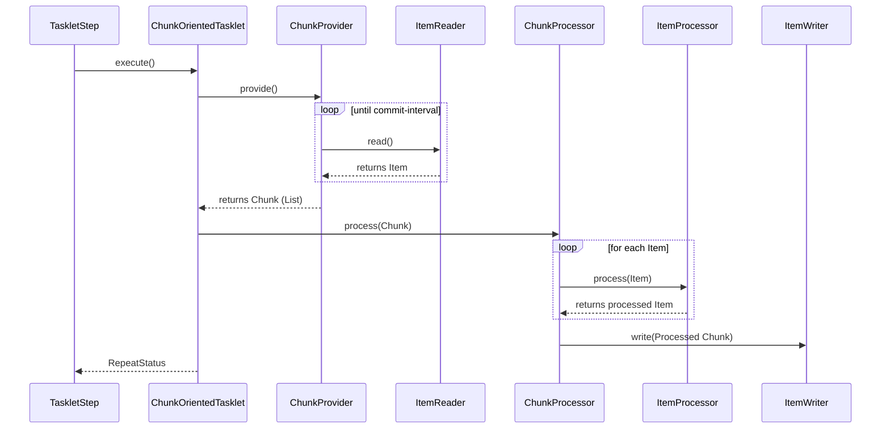

# Chapter 06 - Configuring a Step

## Introduction
Mundu chapters lo `Step` anedi oka job lo independent, sequential phase ani nerchukunnnamu. Ee chapter lo `Step` ni elaa configure cheyyali, chunk-oriented processing ante enti, tasklets, inka step flow (next, conditions) elaa control cheyyali anedi deep ga chusthamu.

## 1. Chunk-oriented Processing

Spring Batch lo ekkuva vadedi "chunk-oriented" processing style. Deeni artham, data ni okkokkati (one at a time) read chesi, oka 'chunk' (list of items) ga kalipi, okesari transaction boundary lona write cheyyadam.

### Behind the Scenes: ChunkOrientedTasklet
Chunk-oriented step ane daaniki gunde kaaya ee `ChunkOrientedTasklet`.

*   **Package Name:** `org.springframework.batch.core.step.item.ChunkOrientedTasklet`
*   **Important Methods:** `execute(StepContribution contribution, ChunkContext chunkContext)`
*   **Who calls it internally:** `TaskletStep` (Lopala idi `Tasklet` laaga behave chestundi)
*   **What it calls next:** `ChunkProvider.provide()` (which calls `ItemReader.read()`) and `ChunkProcessor.process()` (which calls `ItemProcessor.process()` and `ItemWriter.write()`)
*   **Lifecycle:** Transaction lopala `execute()` call avagane idi `ItemReader` nunchi commit-interval varaku records thechukuntundi. Tharuvaatha aa list of records ni processing and writing kosam `ChunkProcessor` ki isthundi.



**Code Example:**
```java
@Bean
public Step step1(JobRepository jobRepository, PlatformTransactionManager transactionManager) {
    return new StepBuilder("step1", jobRepository)
                .<String, String>chunk(10, transactionManager) // commit-interval is 10
                .reader(itemReader())
                .processor(itemProcessor())
                .writer(itemWriter())
                .build();
}
```

### Configuring Skip and Retry Logic
Chala sarlu konni bad records valla poorthi chunk / step fail avvakudadu. Alanti time lo **Skip Logic** vadatharu.
Atlane konni "retryable" errors (e.g. `DeadlockLoserDataAccessException`) vasthe, wait chesi malli try cheste pass avvachu. Alanti time lo **Retry Logic** vadatharu. `faultTolerant()` configure chesinapude idi enable avtundi.

---

## 2. TaskletStep
Chunk-oriented processing okkate kadu, konnisarlu stored procedure call cheyadam, file lu delete cheyadam lanti panulu cheyali. Deeniki `ItemReader/Writer` vadadam kante `Tasklet` vadadam best.

### Behind the Scenes: TaskletStep
*   **Package Name:** `org.springframework.batch.core.step.tasklet.TaskletStep`
*   **Default Implementation:** This is the default implementation of `org.springframework.batch.core.Step` for both Tasklets and Chunks.
*   **Important Methods:** `doExecute()`, `execute()`
*   **Who calls it internally:** `SimpleStepHandler.handleStep()` (Which is called by `SimpleJob`)
*   **What it calls next:** `TransactionManager` (to start transaction) and `Tasklet.execute()`
*   **Lifecycle:** Framework nunchi step execute call vachinappudu, idi Spring `TransactionManager` vaadi kotha transaction begin chestundi. Aa transaction lona `Tasklet.execute()` call chestundi. Exception vasthe rollback, success aithe commit chestundi.

```java
@Bean
public Step deleteFilesStep(JobRepository jobRepository, PlatformTransactionManager txManager) {
    return new StepBuilder("deleteFiles", jobRepository)
                .tasklet(myFileDeletingTasklet(), txManager)
                .build();
}
```


## Inheriting from a Parent Step
Java config lo builders use chestunnapudu prathi sari oke options (listeners, skip limit, etc.) rasedani badulu, okesari master (parent) definition create chesukuni, daanni multiple steps (child steps) ki apply cheyochu.
```java
// Idi Spring Batch v5+ lo builder inheritance antaru, XML lo unna abstract parent step ki similar idi.
```

## 3. Intercepting Step Execution (Listeners)
Step execution lo various phases lo (e.g. chunk start ayye mundu, file read ayyina taruvatha) log cheyyadaniki leda custom logic execute cheyadaniki `StepListener` vadatharu.
Mukhya maina listeners:
- `StepExecutionListener` (`@BeforeStep`, `@AfterStep`): Step start, end ki.
- `ChunkListener` (`@BeforeChunk`, `@AfterChunk`): Prathi transaction (chunk) start, end ki.
- `ItemReadListener`, `ItemProcessListener`, `ItemWriteListener`.

## 4. Controlling Step Flow
Oka job lo steps varusaga run avvalani ledu. Oka step success aithe inkoka step ki, fail aithe inko step ki vellela "Conditional Flow" rayochu.

### Behind the Scenes: BatchStatus vs ExitStatus
Flow control eppudu `ExitStatus` meeda aadharapadi untundi, `BatchStatus` meeda kaadu. `BatchStatus` (STARTED, COMPLETED, FAILED) framework use chestundi. `ExitStatus` (e.g. "COMPLETED WITH SKIPS") anedi caller ki pampinche custom string. Listener dwara manam `ExitStatus` ni override cheyochu.

**Conditional Flow Example:**
```java
return new JobBuilder("job", jobRepository)
        .start(stepA)
        .on("FAILED").to(stepC)   // if stepA fails, go to stepC
        .from(stepA).on("*").to(stepB) // otherwise go to stepB
        .end().build();
```

## 5. Late Binding of Job and Step Attributes
Chala sarlu file names compiler time lo kaakunda, run-time lo Job parameters dwara vasthayi. Alanti attributes ni inject cheyadaniki Spring Batch `Late Binding` support isthundi.

**Behind the Scenes: Scope**
Late binding jaragalante bean ki `@StepScope` leda `@JobScope` thappakunda undali. Ee scopes valla Spring context aa bean ni application start ayyinapudu kaakunda, Step leda Job start ayinappudu initialize chesthundi. Appude `JobParameters` available ga untayi.

```java
@Bean
@StepScope
public FlatFileItemReader<Foo> reader(@Value("#{jobParameters['input.file.name']}") String name) {
    return new FlatFileItemReaderBuilder<Foo>()
                .resource(new FileSystemResource(name))
                .build();
}
```

## Interview Questions
1. **`TaskletStep` lona `ChunkOrientedTasklet` elaa fit avuthundi?**
   - Chunk processing lo unde reader, processor, writer logic antha `ChunkOrientedTasklet` lo wrap ayyi untundi. `TaskletStep` transaction theesukuni ee tasklet ni `execute()` ani pilustundi. So Chunk processing is just a special type of Tasklet.
2. **`@StepScope` enduku vadatharu?**
   - Runtime lo pass chese `JobParameters` leda `ExecutionContext` attributes ni bean loki inject cheyadaniki late binding kosam vadatharu. Application start ki badulu step start ayinappude aa bean create avtundi.

## Summary
Ee chapter lo `TaskletStep` inka `ChunkOrientedTasklet` madyalo unna internal relationships chusamu. Sequence diagrams lo reader/processor/writer ela call avuthayo chusamu. Next chapter lo main workers ayina ItemReaders and ItemWriters gurinchi deep ga discuss cheddamu.
