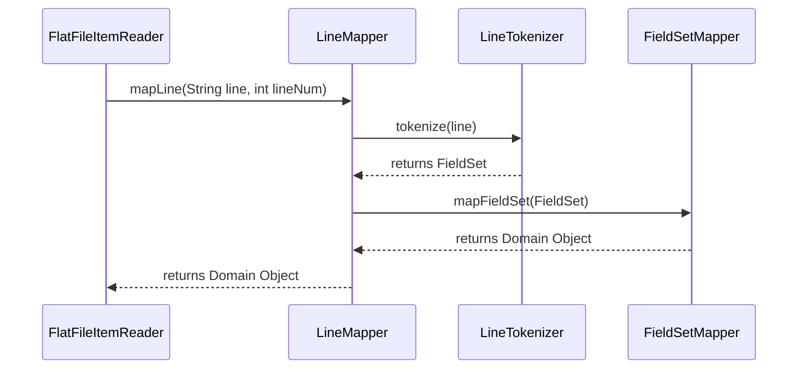
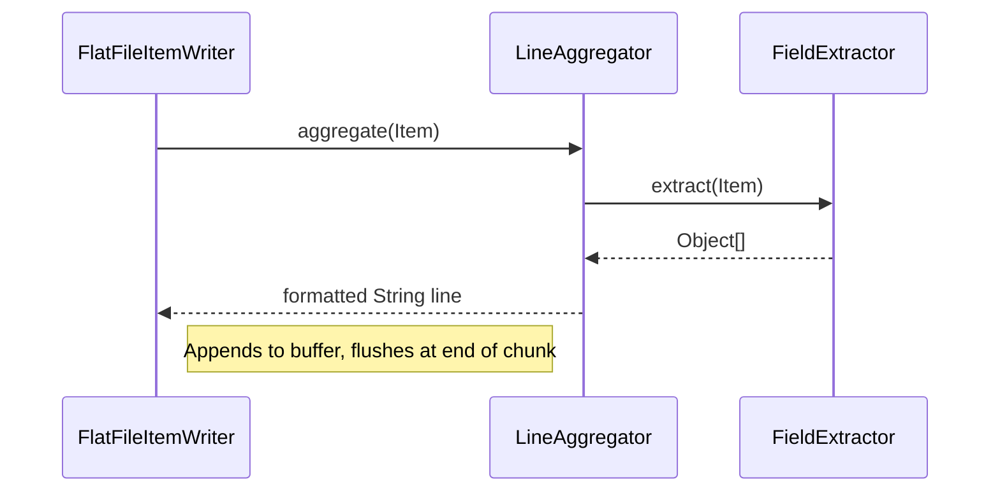

# Chapter 07 - ItemReaders and ItemWriters (Part 2)

## Introduction
Ee part lo manam Spring Batch lo flat files, XML, inka Databases nunchi data ni ela read and write cheyyali anedi deep ga chusthamu. Prathi reader/writer implementation gurinchi, vaati use cases, package names, inka internal mechanics gurinchi detailed ga discuss chesthamu.

---

## 5. Flat Files (Reading)

### FlatFileItemReader
- **Purpose:** Flat file nunchi okko line ni read chesi, daanni oka domain object ga marchadaniki.
- **When to use:** CSV, TSV leda fixed width format lo unna text files process cheyalsinappudu.
- **When NOT to use:** Hierarchical data (XML/JSON) unnapudu leda DB direct access unnapudu.
- **Package Name:** `org.springframework.batch.item.file.FlatFileItemReader`
- **Default Implementation:** Extends `AbstractItemCountingItemStreamItemReader`
- **Important Methods:** `doRead()`, `setLineMapper()`, `setLinesToSkip()`

**Behind the Scenes Execution Flow:**
1. `open()` call ayinappudu, file stream open avuthundi. Restart case lo patha line number nunchi skip chesthundi.
2. `read()` call ayinappudu, okko string line read ayyi `LineMapper` ki pass avuthundi.
3. `LineMapper` aa line ni `LineTokenizer` ki isthundi. Tokenizer aa string ni mukkalu chesi oka `FieldSet` ga marusthundi.
4. Aa `FieldSet` ni `FieldSetMapper` theeskuni, mana domain object (e.g., `Player` class) laaga convert chestundi.



**Code Example:**
```java
@Bean
public FlatFileItemReader<Player> itemReader() {
    return new FlatFileItemReaderBuilder<Player>()
        .name("playerReader")
        .resource(new FileSystemResource("players.csv"))
        .delimited()
        .names("ID", "lastName", "firstName", "position", "birthYear", "debutYear")
        .targetType(Player.class)
        .build();
}
```
**Code Explanation:** `FlatFileItemReaderBuilder` vaadadam valla manam manually `LineMapper`, `LineTokenizer`, inka `FieldSetMapper` rayalsina avasaram ledu. `targetType` ivvagane `BeanWrapperFieldSetMapper` ni adi automatic ga vadeskuntundi.

**Best Practices:** Always use builders. Specify encoding properly (default is UTF-8).
**Common Mistakes:** `targetType` pass chesetapudu, a class ki thappakunda "default constructor" inka "setter methods" undali. Leda reflection fail avuthundi. Fixed-length files vadetappudu `setStrict(false)` pettakapothe, record length thakkuva unte `IncorrectLineLengthException` vastundi.
**Performance:** Excellent for sequential reads. Memory footprint is low since it reads line-by-line.
**Enterprise Use Cases:** EOD reconciliation file loads from external vendor systems.
**Interview Questions:** What is a `FieldSet`? *It's Spring Batch's abstraction for flat file lines, conceptually similar to JDBC ResultSet.*

---


### Exception Handling in Flat Files
Flat files format eppudu perfect ga undadu. Thappu data unna lines valla parse exceptions vastayi. Spring Batch lo viatiki rendu exceptions untayi:
- `FlatFileParseException`: File read chestunnapudu oche errors.
- `FlatFileFormatException`: `LineTokenizer` daggara (e.g. incorrect tokens count leda fixed width length tapu) vachche exception.
- `IncorrectTokenCountException`: Columns names ichina daanikante file lo unna tokens mismatch aythe (Delimited/Fixed).
- `IncorrectLineLengthException`: Fixed length file lo define chesina widths motham kalipina length inka line length match avvakapothe (strict mode lo).

`tokenizer.setStrict(false)` vaadithe FixedLengthTokenizer line length validation ni aapi, unnanta varaku map chesi, migata vi empty peduthundi.


## 6. Flat Files (Writing)

### FlatFileItemWriter
- **Purpose:** Domain objects ni string lines ga marchi output file lo rayadaniki.
- **When to use:** Business output ni text reports, extracts leda vendor feeds ga CSV/fixed-width formats lo export cheyadaniki.
- **When NOT to use:** Output format XML/JSON leda Database ayithe.
- **Package Name:** `org.springframework.batch.item.file.FlatFileItemWriter`
- **Default Implementation:** Extends `AbstractItemStreamItemWriter`
- **Important Methods:** `write()`, `setLineAggregator()`, `setAppendAllowed()`

**Behind the Scenes Execution Flow:**
1. `write(Chunk)` method call ayinapudu, chunk lo unna prathi item meeda `LineAggregator.aggregate()` call avuthundi.
2. `LineAggregator` lopalunna `FieldExtractor` object loni properties ni theeskuni array ga marusthundi.
3. Aa array ni delimiter tho kalipi oka single string (line) ga marusthundi.
4. Ee lines annitni okesari buffer nunchi file loki flush chesthundi.



**Code Example:**
```java
@Bean
public FlatFileItemWriter<CustomerCredit> itemWriter(Resource outputResource) {
    return new FlatFileItemWriterBuilder<CustomerCredit>()
        .name("customerCreditWriter")
        .resource(outputResource)
        .delimited()
        .delimiter(",")
        .names("name", "credit")
        .build();
}
```
**Code Explanation:** Bean properties ni extract chesi, comma delimiter add chesi file ki rayadaniki builder vaduthunnam.
**Best Practices:** Temporary files meeda rasi, step succeed ayyaka finalize file ki move cheyadam manchidi.
**Common Mistakes:** `appendAllowed` false petti multi-threaded environment lo file ni overwrite cheseyyadam.

---

## 7. XML Reading and Writing

### StaxEventItemReader
- **Purpose:** XML files ni event stream (StAX) dwara parse chesi Java objects ga ivvadaniki.
- **When to use:** Large XML payload unnapudu memory ni save cheyadaniki.
- **When NOT to use:** Chinna XML objects unnappudu standard DOM parsers better.
- **Package Name:** `org.springframework.batch.item.xml.StaxEventItemReader`
- **Default Implementation:** OXM delegate abstraction.
- **Important Methods:** `setFragmentRootElementName()`, `setUnmarshaller()`

**Behind the Scenes:**
XML resource ni open chesaka, reader event stream ni check chestundi. `fragmentRootElementName` match ayina tag kanipinchagane, daanni oka individual XML document ga thiyyi, Unmarshaller ki pamputhundi. OXM daanni POJO ga isthundi. StAX use cheyadam valla idi DOM laga poorthi file ni okesari RAM loki load cheyadu.

**Code Example:**
```java
@Bean
public StaxEventItemReader<Trade> itemReader() {
    Jaxb2Marshaller tradeMarshaller = new Jaxb2Marshaller();
    tradeMarshaller.setClassesToBeBound(Trade.class);

    return new StaxEventItemReaderBuilder<Trade>()
        .name("itemReader")
        .resource(new FileSystemResource("trades.xml"))
        .addFragmentRootElements("trade")
        .unmarshaller(tradeMarshaller)
        .build();
}
```

---

## 8. Database Reading

### JdbcCursorItemReader
- **Purpose:** Okasari execute chesina query result meeda cursor open petti, okko row read cheyadaniki.
- **When to use:** Thread single ga unnappudu (not partitioned) inka DB connections ekuva sepu open unna parvaledu anukunnapudu.
- **When NOT to use:** High concurrency / partitioned batch steps lo thread safety kavalsinappudu.
- **Package Name:** `org.springframework.batch.item.database.JdbcCursorItemReader`
- **Default Implementation:** Uses standard `java.sql.ResultSet` cursor.
- **Important Methods:** `setSql()`, `setRowMapper()`

**Behind the Scenes:**
`open()` jariginapudu, query run ayyi `ResultSet` vasthundi. Prathi `read()` call ki `ResultSet.next()` call ayyi, `RowMapper` dwara object mapping jarugutundi. Motham aipoyaka `close()` lo result set close avtundi.

### JdbcPagingItemReader
- **Purpose:** Query ni mukkaluga chesi (e.g., LIMIT 1000 OFFSET 0), specific "page" size data ni thecchukovadaniki.
- **When to use:** Multi-threaded/partitioned steps lo cursor vadalem (not thread safe), appudu e paging reader vadali.
- **When NOT to use:** Simple queries in small datasets where cursor overhead is negligible.
- **Package Name:** `org.springframework.batch.item.database.JdbcPagingItemReader`
- **Default Implementation:** Uses `PagingQueryProvider` to generate DB specific limit/offset SQL.
- **Important Methods:** `setQueryProvider()`, `setPageSize()`

**Behind the Scenes:**
Reader open chesaka `read()` call chesthe, lopalunna buffer khali ayite, automatically DB ki velli next `pageSize` records fetch cheskuni vastundi. Ikkada `sortKey` pakka ga ivvali, leda duplicate records leda missed records ocche chance undi.

**Code Example (Paging):**
```java
@Bean
public JdbcPagingItemReader<CustomerCredit> itemReader(DataSource dataSource, PagingQueryProvider queryProvider) {
    return new JdbcPagingItemReaderBuilder<CustomerCredit>()
        .name("creditReader")
        .dataSource(dataSource)
        .queryProvider(queryProvider) // Specifies select, from, where, sortKey clauses
        .pageSize(1000)
        .rowMapper(new CustomerCreditRowMapper())
        .build();
}
```
**Best Practices:** `sortKey` eppudu unique column(s) (like Primary Key) ayyi undali.
**Interview Questions:** What is the difference between Cursor and Paging readers? *Cursor keeps a persistent DB connection open tracking `ResultSet.next()`, whereas Paging requests data in chunks (pages) explicitly via SQL Limit/Offset, saving DB connection overhead over long running steps and being thread-safe.*

## Summary
Ee Part 2 lo manam real-world I/O operations (File parsing with LineMappers, XML processing via StAX, and robust Database interactions with Cursors and Paging) gurinchi deep ga internals chusamu. Out-of-box thechipettina `Builder` factories valla Spring Batch lo I/O operations chala simplified ga, mariyu highly efficient ga configure chesukovachu. Next chapter lo manam `ItemProcessor` gurinchi chusthamu.
