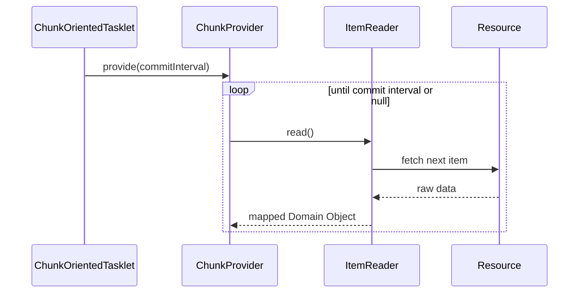

# Chapter 07 - ItemReaders and ItemWriters

## Introduction
Batch processing lo mukhya maina pani: pedda amount lo data ni chadavadam (read), daanni transform cheyadam leda calculate cheyadam (process), inka result ni ekkadaina rayadam (write). Spring Batch deenikosam moodu key interfaces ni istundi: `ItemReader`, `ItemProcessor`, mariyu `ItemWriter`. Ee chapter lo manam veeti gurinchi, inka veetiki avasaramaina `ItemStream` gurinchi deeply nerchukuntamu.

---

## 1. ItemReader
`ItemReader` anedi okko item ni input nunchi retrieval cheyadaniki vaade abstraction. Idi database nunchi row kavachu, flat file nunchi line kavachu, leda XML nunchi oka element kavachu.

### Behind the Scenes: ItemReader
*   **Package Name:** `org.springframework.batch.item.ItemReader`
*   **Default Implementation:** Base interface. Used by implementations like `FlatFileItemReader`, `JdbcCursorItemReader`, etc.
*   **Important Methods:** `T read() throws Exception`
*   **Who calls it internally:** `org.springframework.batch.core.step.item.ChunkProvider` (usually `SimpleChunkProvider.provide()`)
*   **What it calls next:** Target resource APIs (like JDBC `ResultSet.next()` or Java `BufferedReader.readLine()`).
*   **Lifecycle:** Step start avagane open avtundi. Chunk size reach ayye varaku `ChunkProvider` lona while loop lo idi thiruguthune untundi. Return cheyadaniki items lekapothe `null` isthundi. Appudu ChunkProvider aagipothundi.



---

## 2. ItemWriter
`ItemWriter` anedi `ItemReader` ki inverse. Input resource ni open chesi chadivinatte, output resource ni open chesi data rayali. Ikkada difference enti ante, `ItemReader` okko item read chesthe, `ItemWriter` okesari oka **batch leda chunk** of items ni write chestundi.

### Behind the Scenes: ItemWriter
*   **Package Name:** `org.springframework.batch.item.ItemWriter`
*   **Default Implementation:** Base interface. Used by implementations like `FlatFileItemWriter`, `JdbcBatchItemWriter`.
*   **Important Methods:** `void write(Chunk<? extends T> items) throws Exception`
*   **Who calls it internally:** `org.springframework.batch.core.step.item.ChunkProcessor` (usually `SimpleChunkProcessor.process()`)
*   **What it calls next:** Target resource APIs (like JDBC `PreparedStatement.executeBatch()` or Java `BufferedWriter.write()`).
*   **Lifecycle:** Items anni read mariyu process (optional) ayyaka, transaction commit ayye mundu, ee List ni okesari buffer nunchi destination loki flush chestundi.

---


## 2.5 ItemProcessor
`ItemReader` chadivindi, `ItemWriter` rastundi. Ee madhyalo data ni transform cheyadaniki leda filter cheyadaniki vadutaru `ItemProcessor`.

### Behind the Scenes: ItemProcessor
*   **Package Name:** `org.springframework.batch.item.ItemProcessor`
*   **Important Methods:** `O process(I item) throws Exception`
*   **Who calls it internally:** `ChunkProcessor.process()`
*   **Lifecycle:** Oka item processor ki vochinapudu, adhi data ni transform chesi isthundi. Oka vela aa item validation lo fail aithe leda filter cheyali anukunte, processor nunchi `null` return cheyali. Appudu `ItemWriter` ki aa item velladhu.

## 3. ItemStream
Reader leda writer file ni leda database connection ni open cheyyali inka close cheyyali. Alage restart kosam state ni save cheyali. Deenikosame `ItemStream` interface vachindi.

### API Insight
```java
public interface ItemStream {
    void open(ExecutionContext executionContext) throws ItemStreamException;
    void update(ExecutionContext executionContext) throws ItemStreamException;
    void close() throws ItemStreamException;
}
```

**Behind the Scenes Execution Flow:**
1. **`open()`**: Step start ayinapudu call avtundi. Ikkada file streams open avthayi. Oka vela job restart avthunte, `ExecutionContext` lo unna patha state (e.g. `lines.read.count=400`) chusi, file tondaraga aa line varaku forward avtundi.
2. **`update()`**: Prathi chunk commit ayye **mundu** call avtundi. Ikkade `ItemReader` "nenu 500 lines chadivesanu" ani `ExecutionContext` lo count update chestundi, so that database lo ah state persist avtundi.
3. **`close()`**: Step end ayinapudu call avtundi. Resources anni safe ga release avthayi.

---

## 4. The Delegate Pattern and Registering with the Step
Spring Batch lo chala sarlu okate component inkoka component ki panulu delegate chestundi (e.g. `CompositeItemWriter` multiple writers ki delegate chestundi).

**Common Mistake:**
Manam `ItemReader` leda `ItemWriter` ni `StepBuilder` lo pass chesinapudu, vatiki `ItemStream` (leda `StepListener`) implement chesi unte, Spring Batch vaatini **automatically register** chestundi.
Kani `CompositeItemWriter` lanti vi vadutunappudu, lopaliki pass chese sub-writers ni Spring Batch choodaledu!

**Solution:**
Veetini manually register cheyali `stream()` method vadukuni.

```java
@Bean
public Step step1(JobRepository jobRepository, PlatformTransactionManager transactionManager) {
    return new StepBuilder("step1", jobRepository)
                .<String, String>chunk(2, transactionManager)
                .reader(fooReader())
                .writer(compositeItemWriter())
                // Manual registration of delegate!
                .stream(barWriter())
                .build();
}
```

## Interview Questions
1. **`ItemReader` null return cheste emavutundi?**
   - Spring Batch (ChunkProvider) ki items anni poorthi ayyayi ani ardhamaipothundi. Ventane aa chunk ni process/write chesi, step ni complete chestundi. Exception emitlu raadu.
2. **`ItemWriter` okkosari empty list enduku receive chesukuntundi?**
   - Endukante chunk loni items anni `ItemProcessor` lono leda skip logic dwara filter/skip aipoyi undochu. Writer deenni error ga chudakunda gracefully handle cheyali.
3. **`ItemStream` interface yokka mukhya uddesham enti?**
   - Execution resources (files, DB connections) ni open/close cheyadaniki, inka commit ki mundu `ExecutionContext` lo state ni save cheyadaniki, deeni vallane fail aina job malli ekkadnunchi apindo akkada nunchi start (restart) avvagaludu.

## Summary
`ItemReader` and `ItemWriter` lu Spring Batch lo base components, ivi chadavadaniki, rayadaniki vaadatharu. Veetitho patu `ItemStream` kalavadam valla framework ki resource management inka restartability thelisosthundi. Delegations vadinappudu jagrattaga stream registration cheyyadam chala mukhyam. Part 2 lo specific ga Flat files, XML, inka Database Readers/Writers gurinchi deep ga velludam.
