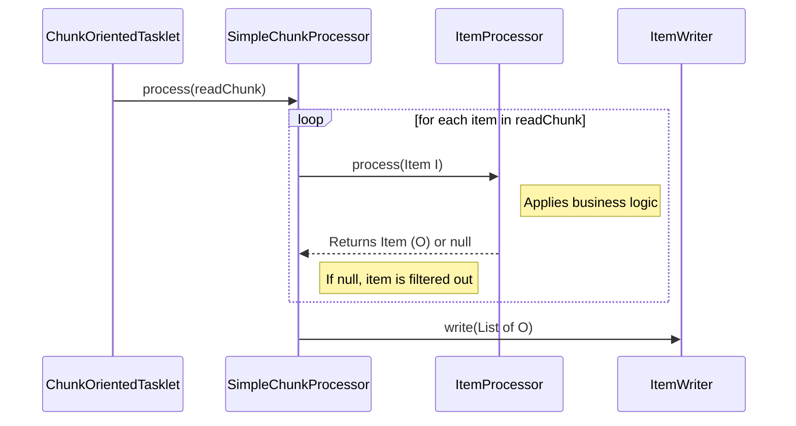

# Chapter 08 - Item Processing

## Introduction
Spring Batch lo data chadavadaniki `ItemReader` mariyu rayadaniki `ItemWriter` unnai. Kani, chadhivina data ni rayadaniki mundu transform cheyali, validate cheyali, leda konni items ni filter out cheyali anukunte em chestaru? Akkade **`ItemProcessor`** picture loki vastundi. Ee chapter lo `ItemProcessor` yokka internals, elaa chain cheyali, inka data elaa filter leda validate cheyalo detailed ga chusthamu.

---

## 1. ItemProcessor

`ItemReader` leda `ItemWriter` ki delegates vadi business logic add cheyachu (e.g., `CompositeItemWriter`). Kani adi kodiga unnatural ga untundi. Daaniki badulu, data ni transform cheyadaniki Spring Batch `ItemProcessor` ane oka explicit abstraction ni icchindi.

### Behind the Scenes: ItemProcessor
*   **Package Name:** `org.springframework.batch.item.ItemProcessor`
*   **Default Implementation:** Base interface. Used by implementations like `CompositeItemProcessor`, `ValidatingItemProcessor`.
*   **Important Methods:** `O process(I item) throws Exception`
*   **Who calls it internally:** `org.springframework.batch.core.step.item.ChunkProcessor` (specifically `SimpleChunkProcessor.doProcess()`)
*   **What it calls next:** Your custom business logic, mapping routines, or external services.
*   **Lifecycle:** Reader chunk motham (e.g. 100 items) thecchaka, `ChunkProcessor` loop theeskuni okko item ni `process()` ki isthundi. Process ayina tarvata final list mothanni okesari `ItemWriter.write()` ki pamputhundi.



### Purpose
- **Transform:** Oka data type (Input) nunchi inko data type (Output) ki marchadaniki (e.g., `Foo` -> `Bar`).
- **Enrich:** ItemReader thecchina data ki inka extra reference data ni thagilinchadaniki (e.g., DB lookup).
- **Filter:** Invalid ga unna leda avasaram leni items ni write phase ki vellakunda aapadaniki.

---

## 2. Chaining ItemProcessors

Oka pedda complex transformation ni okate `ItemProcessor` lo raste maintain cheyadam kastam. Anduke Spring Batch **`CompositeItemProcessor`** ni istundi. Deeni dwara multiple processors ni oka "chain" laaga link cheyochu.

### Behind the Scenes: `CompositeItemProcessor`
- **Package Name:** `org.springframework.batch.item.support.CompositeItemProcessor`
- **Default Implementation Mechanics:** Idi delegates list ni theeskuni, first processor output ni second processor ki input ga pamputhundi.

```java
@Bean
public CompositeItemProcessor<Foo, Foobar> compositeProcessor() {
    List<ItemProcessor<?, ?>> delegates = new ArrayList<>();
    delegates.add(new FooToBarProcessor());     // Foo -> Bar
    delegates.add(new BarToFoobarProcessor());  // Bar -> Foobar

    CompositeItemProcessor<Foo, Foobar> processor = new CompositeItemProcessor<>();
    processor.setDelegates(delegates);
    return processor;
}
```
**Important:** Chain loni ye processor ayina `null` return cheste, aa chain akkade break ayyi, aa item ventane filter aipothundi. Next delegates ki velladu.

---

## 3. Filtering Records

**Skipping vs Filtering:**
- **Skipping:** Item lo error undi, parsing thappu aindi leda exception vachindi ante daanni "skip" antaru. Idi thappu data.
- **Filtering:** Item format correct gane undi, kani business rule prakaram idi ippudu process avvakudadu (e.g., Delete records ni update job lo ramanappudu). Deenni "filter" antaru. Idi correct data ne, kani ignore cheyali.

**How to filter?**
`ItemProcessor` nunchi **`null`** return cheste, Spring Batch aa item ni filter chesestundi. Adi `ItemWriter` ki pampinche list loki add avvadu.

---

## 4. Validating Input

ItemReader format level (e.g. integer badulu string vaste) validations chestundi, kani business validations (e.g. Age negative ga undakudadu) cheyyadu. Deenikosam Spring Batch `ValidatingItemProcessor` ni istundi.

### API Insight
- **Package Name:** `org.springframework.batch.item.validator.ValidatingItemProcessor`
- **Interface:** `org.springframework.batch.item.validator.Validator<T>`

Idi okavela invalid aithe `ValidationException` throw chestundi. Idi jarigithe record **skip** avtundi (null laaga filter avvadu).

**Code Example using JSR-303 (Bean Validation):**
Meeru Spring `Validator` rasthe `SpringValidator` vadachu. Leda standard JSR-303 annotations (`@NotEmpty`, `@Min`) objects meeda vadithe, `BeanValidatingItemProcessor` vadachu.

```java
@Bean
public BeanValidatingItemProcessor<Person> beanValidatingItemProcessor() {
    BeanValidatingItemProcessor<Person> processor = new BeanValidatingItemProcessor<>();

    // If true, invalid items are filtered (returns null) instead of throwing exception!
    processor.setFilter(true);
    return processor;
}
```

---

## 5. Fault Tolerance & Idempotency

Oka step "fault-tolerant" (skip leda retry configure chesunte) ga unnapudu, konni sarlu transaction rollback ayyi malli same item processing ki ravachu.
Anduke, **`ItemProcessor` idempotent ga undali**.
- **Rule of thumb:** Input item loni state ni modify cheyakandi. Kotha object ni create chesi return cheyandi. Ala aithe malli same input vachinappudu processing elanti side-effects ivvadu.

---

## Interview Questions
1. **ItemProcessor lo `null` return cheste em avtundi? Daanni exception tho compare cheyandi.**
   - `null` return cheste adi item ni filter chestundi. Adi error kaadu, just ignore chestundi (`filterCount` perugutundi). Exception throw cheste adi fault, retry/skip policies check cheskuntundi, daanni skip antaru (`processSkipCount` perugutundi).
2. **ItemProcessor idempotent ga enduku undali?**
   - Chunk processing lo okavela error vachi transaction rollback ayite, aa same chunk loni items malli retry avvochu. Appudu processor previous partial updates valla thappu output ivvakudadu. Input ni muttukokunda kotha object ni create cheyadam safe.
3. **Multiple transformations cheyali ante elaa approach avutharu?**
   - `CompositeItemProcessor` vadathamu. Daantlo list of `ItemProcessor` delegates isthe, okadanidanti output inkodaniki input ga pampichi chain execute chestundi.

## Summary
`ItemProcessor` anedi chala simple ayina powerful interface. Idi data ni enrich cheyadaniki, transform cheyadaniki, inka business validations inka filters apply cheyadaniki use avtundi. Internal ga idi `SimpleChunkProcessor` dwara okkokka item paina call avtundi. Idempotency ni maintain cheyadam anedi enterprise batch processing lo oka chala pedda best practice.
