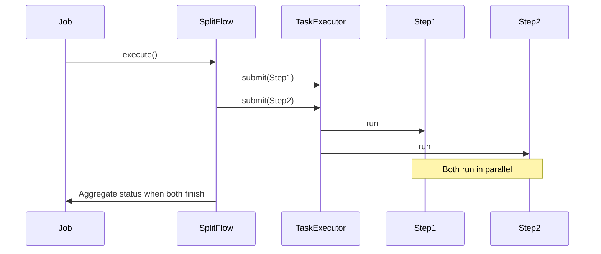
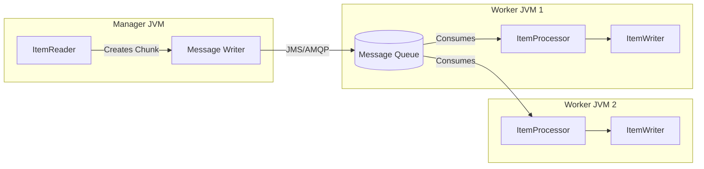

# Chapter 09 - Scaling and Parallel Processing

## Introduction
Chala batch processing problems simple single-threaded, single-process jobs thone solve aipothayi. Kani millions of records process cheyalsivachinapudu leda tight SLAs unnappudu, manam scaling and parallel processing gurinchi alochinchali. Spring Batch deenikosam multiple options istundi. Ee chapter lo single-process inka multi-process scaling techniques, vatillo internal ga em jarugutundi anedi deep ga nerchukuntamu.

---

## 1. Multi-threaded Step (Single Process)

Sadaarana ga, oka `Step` lo reading, processing, inka writing antha oka single main thread lone jarugutundi. Deenni parallelize cheyadaniki manam oka `TaskExecutor` ni Step ki add cheyachu.

### Behind the Scenes
- **Key Interface:** `org.springframework.core.task.TaskExecutor`
- **Default Behavior:** Step by default `SyncTaskExecutor` vaduthundi (single thread). Parallel kavali ante `SimpleAsyncTaskExecutor` leda `ThreadPoolTaskExecutor` ivvali.
- **Execution Flow:** Chunk theeskuni processing inka writing chestunappudu, multiple threads parallel ga chunks ni execute chestayi.

**Source Code Flow:**
```text
TaskletStep#execute()
  ↓
ChunkOrientedTasklet#execute()
  ↓
(TaskExecutor spanws thread) -> ChunkProvider#provide() / ChunkProcessor#process()
```

**Important Caveats:**
- **Thread Safety:** Mee `ItemReader` inka `ItemWriter` thappakunda thread-safe ayyi undali. Leda data miss avvadam/duplicate avvadam pakka. Example ki, ordinary `FlatFileItemReader` thread-safe kaadu (synchronize cheyali).
- **Transaction Scope:** Prathi worker thread daani sontha chunk transaction ni manage chestundi.

---


## Important Note on Thread-Safety
When utilizing Multi-threaded Steps, you must either wrap your stateful components (like readers/writers) in thread-safe wrappers (e.g. `SynchronizedItemStreamReader`) or explicitly set `saveState=false` on components that don't support concurrent execution to avoid corrupted state in the database during restarts.

## 2. Parallel Steps (Single Process)

Oka job lo konni steps madhya dependencies emi lekapothe (e.g. loading customers inka loading products), vaatini parallel ga run cheyochu.

**Behind the Scenes:**
Flow builder lo `split()` method vadathamu. Idi `FlowJobBuilder` lopaliki velli `org.springframework.batch.core.job.flow.support.SimpleFlow` ni parallel ga start chestundi.



---

## 3. Local Chunking (Single Process)

Idi Spring Batch 6.0 lo vacchina **kotha feature**. Chunk-oriented step lona, chunks ga divide ayyaka aa chunks ni multiple threads ki icchi process inka write cheyinchadam deeni uddesham.

### Behind the Scenes: `ChunkTaskExecutorItemWriter`
- **Package Name:** `org.springframework.batch.item.ChunkTaskExecutorItemWriter`
- **Execution Flow:** Reader sequence lone data ni thread-safe ga read chestundi. Chunk size reach avvagane, aa chunk ni `ChunkTaskExecutorItemWriter` theeskuni oka worker thread ki submit chestundi. Aa thread lona processing inka DB/File writing jarugutundi.

*Note:* Idi multi-threaded step laga kadu. Ikkada reader single thread lone untundi, kani chunks writing and processing matrame parallelize avutundi. Idi thread-safe leni readers ki chala upayogapade technique!

---

## 4. Remote Chunking (Multi Process)

Local JVM lo resources (CPU/Memory) sariponappudu, processing ni vere machines (workers) ki distribute cheyali. Deenike Remote Chunking vadathamu.

### Behind the Scenes
- **Mechanics:** Manager JVM lo `ItemReader` okkate data chadivi, aa data ni JMS/AMQP queue loki push chestundi (instead of standard `ItemWriter`). Worker JVMs aa messages theeskuni, `ItemProcessor` inka `ItemWriter` ni execute chesi, result ni malli manager ki pampistayi.
- **Enterprise Note:** Ikkada Manager eppudu I/O bottleneck avvakudadu. Processing/Writing chala heavy unnapude ee architecture suitable.



---

## 5. Partitioning (Single or Multi Process)

Partitioning anedi enterprise batch processing lo the most powerful scaling technique. Oka pedda step ni chinna chinna mukkalu (partitions) ga viadagotti okesari execute cheyadam.

### Behind the Scenes: Partitioning SPI
Mukhya maina 3 components ikkada pani chestayi:
1. **`PartitionStep`**: Idi manager step.
2. **`Partitioner`**: Idi data ni ela divide cheyalo chepthundi (e.g. A-F, G-M, N-Z). Prathi partition ki oka `ExecutionContext` ni create chestundi.
3. **`PartitionHandler`**: Aa create ayina partitions ni workers ki elaa pampalo (Local threads aa, leda Kafka/JMS dwara remote machines kaa) idi decide chestundi.

```text
Source Code Flow:

PartitionStep#execute()
  ↓
StepExecutionSplitter#split() (Calls your Partitioner to generate contexts)
  ↓
PartitionHandler#handle() (Sends execution requests to workers)
  ↓
(Worker receives StepExecution Request)
  ↓
TaskletStep#execute() (With specific partition ExecutionContext)
```

**Local Partitioning Example:**
Local JVM lone threads vadi partitioning cheyalante `TaskExecutorPartitionHandler` vadatharu.
```java
@Bean
public PartitionHandler partitionHandler() {
    TaskExecutorPartitionHandler handler = new TaskExecutorPartitionHandler();
    handler.setTaskExecutor(taskExecutor());
    handler.setStep(workerStep());
    handler.setGridSize(10); // 10 threads/partitions
    return handler;
}
```
*API Insight:* Partitioner nunchi oche `ExecutionContext` values ni worker step lona `@StepScope` vadi late binding dwara query param leda filename ga vaadukuntaru.

---

## 6. Remote Step Execution (Multi Process)
Idi kuda Spring Batch 6.0 nunchi improve aina feature. Oka full `Step` ni as-it-is ga inko remote machine lo run cheyyadaniki `RemoteStep` class vaadatharu. Manager just request pamputhundi, worker motham step execute chesi status isthundi.

---

## Interview Questions
1. **Multi-threaded step ki Local Partitioning ki difference enti?**
   - Multi-threaded step lo okate `StepExecution` untundi, multiple threads same reader/writer ni parallel ga kotti data process chestayi (Requires thread-safe components). Local partitioning lo `Partitioner` dwara data explicitly split ayyi, prathi thread ki oka kotha `StepExecution` inka separate reader/writer instances untayi (No thread-safety issues on components).
2. **Remote Chunking epudu vadali, Partitioning epudu vadali?**
   - Read cheyadam fast ga ayyi, Process/Write cheyadam heavy/slow ga unte Remote Chunking (Manager -> Workers via Queue) vadali. Ala kadu, complete input dataset ni chunks ga munde split cheyyagaligithe, Partitioning vadadam best endukante network overhead thakkuva untundi.
3. **Partitioning lo Step execution names ela vastayi?**
   - Manager step peru `step1` aithe, workers ki `step1:partition0`, `step1:partition1` ani perlanu framework (SimplePartitioner) generate chestundi.

## Summary
Ee chapter lo Spring Batch elaa millions of records ni efficiently process cheyyadaniki single-JVM inka distributed architectures istundo thelusukunnnamu. Thread safety problems nunchi escape avvadaniki Local Partitioning leda Spring Batch 6.0 loni Local Chunking excellent choices. Next chapter lo Repeat inka Completion policies gurinchi chusthamu.
## 5. Thread Safety in Parallel Steps
Parallel processing (e.g. Multi-threaded Step) vadetappudu prathi ItemReader, ItemWriter thread-safe ayi undali. Leda data corruption avuthundi. FlatFileItemReader by default thread safe kaadu, anduku `SynchronizedItemStreamReader` wrapper vadali.
