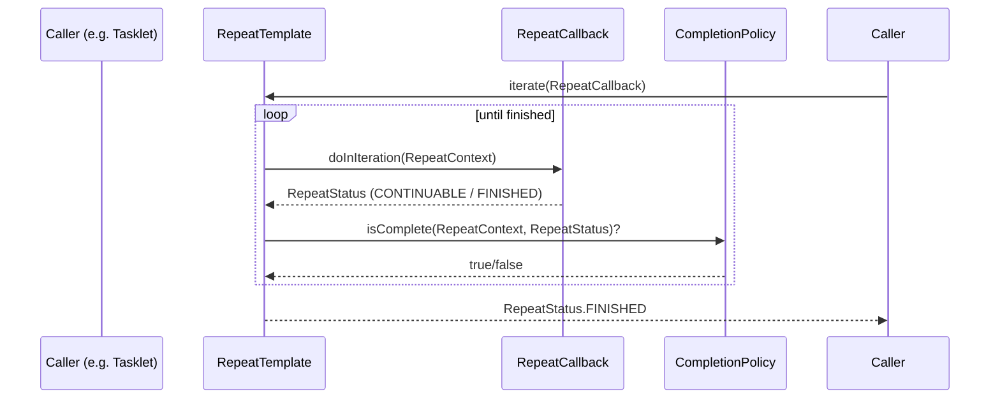

# Chapter 10 - Repeat

## Introduction
Batch processing mottam repetitive actions paine aadharapadi untundi. Oka input file nunchi records chadavadam, process cheyyadam, inka rayadam - idi oka pedda while-loop laanti logic. Spring Batch ee repetition ni strategize cheyadaniki, general-purpose ga vadadaniki `RepeatOperations` ane oka iterator framework ni thecchindi. Ee chapter lo `RepeatTemplate`, completion policies, inka exception handling gurinchi chusthamu.

---

## 1. RepeatOperations & RepeatTemplate

Java loni standard `Iterator` leda `while` loop ki badulu, Spring Batch `RepeatOperations` ni vaduthundi.

### Behind the Scenes: RepeatTemplate
*   **Package Name:** `org.springframework.batch.repeat.support.RepeatTemplate`
*   **Important Methods:** `iterate(RepeatCallback callback)`
*   **Who calls it internally:** `ChunkOrientedTasklet` (via `ChunkProvider` and `ChunkProcessor`)
*   **What it calls next:** `RepeatCallback.doInIteration()` (Mee business logic or reading/writing logic).
*   **Lifecycle:** Idi callback loni code ni repeat chestune untundi, eppativarakante `CompletionPolicy` finish ani cheppe varaku, leda exception oche varaku.



**Code Example:**
```java
RepeatTemplate template = new RepeatTemplate();
template.setCompletionPolicy(new SimpleCompletionPolicy(2)); // Runs only 2 times

template.iterate(new RepeatCallback() {
    public RepeatStatus doInIteration(RepeatContext context) {
        System.out.println("Processing chunk...");
        return RepeatStatus.CONTINUABLE;
    }
});
```

---

## 2. RepeatStatus

`RepeatCallback` nunchi oche return value ni `RepeatStatus` antaru. Idi oka Enum.
*   **`CONTINUABLE`**: Inka work baki undi, loop ni continue cheyi.
*   **`FINISHED`**: Work aipoindi, leda nenu inka stop cheseddam anukuntunna, iteration aapeyi.

*API Insight:* Rendu status lanu `and()` method vaadi kalapavacchu. Ekkadaina okka `FINISHED` vachina, final result `FINISHED` aipothundi.

---

## 3. RepeatContext
Idi just oka attribute bag (Map lanti di). Iteration start ayyinappudu create ayyi, end ayyaka destroy aipothundi.

- **Usage:** Iteration loop madhyalo variables ni gurtu pettukovadaniki (e.g. enni sarlu error vachindi ani count cheyadaniki).
- **Parent Context:** Okavela nested repeats unte (e.g. Chunk lopalinki chunk), parent context nunchi state theచ్చుకోవచ్చు.

---

## 4. Completion Policies
Loop eppudu aagalo decide chesedi `CompletionPolicy`. Idi `RepeatTemplate` lopaliki inject chestaru.

*   **Package Name:** `org.springframework.batch.repeat.CompletionPolicy`
*   **Common Implementations:**
    *   `SimpleCompletionPolicy`: Specific number of times (e.g., commit-interval) run chesi aputhundi.
    *   `TimeoutTerminationPolicy`: Specific time (e.g., 5 seconds) datinatharuvaatha aputhundi.

*Enterprise Note:* Meeru custom policy kuda rayochu. Example ki, "Online users login ayye time (morning 8 AM) datithe batch processing loop ni ventane aapeyi" ani rayochu.

---

## 5. Exception Handling
Loop madhyalo exception vasthe, loop break aipovala leda continue avvala ani decide chesedhi `ExceptionHandler`.

*   **Package Name:** `org.springframework.batch.repeat.exception.ExceptionHandler`
*   **Common Implementations:**
    *   `SimpleLimitExceptionHandler`: Oka particular exception vasthu unte (e.g. DB Lock exception), n sarlu varaku ignore chestundi. Limit daatithe re-throw chesi loop fail chestundi.

---

## 6. RepeatListeners
Oka `StepListener` laage, repeat iterations madhyalo extra hooks kavalante `RepeatListener` vadatharu.
Idi `open()`, `before()`, `after()`, `onError()`, inka `close()` callbacks isthundi.

---

## 7. Declarative Iteration
Konni sarlu framework lekunda, manam rase normal Spring Service lo method repetitively call avvali (e.g. Queue nunchi message continuously pull cheyadaniki) anukunte, Spring AOP vaadi `@Bean` level lo `RepeatOperationsInterceptor` configure cheyochu.

```java
@Bean
public MyService myService() {
    ProxyFactory factory = new ProxyFactory(RepeatOperations.class.getClassLoader());
    factory.setInterfaces(MyService.class);
    factory.setTarget(new MyService());

    // Wraps processMessage in a RepeatTemplate loop!
    RepeatOperationsInterceptor interceptor = new RepeatOperationsInterceptor();
    ((Advised) factory.getProxy()).addAdvisor(new DefaultPointcutAdvisor(..., interceptor));
    return (MyService) factory.getProxy();
}
```

---

## Interview Questions
1. **Spring Batch enduku normal `while` loop vadakunda `RepeatTemplate` vadtundi?**
   - Normal `while` loop hardcoded untundi. `RepeatTemplate` vadadam valla "eppudu aagali" anedi (CompletionPolicy), "exception oste em cheyali" anedi (ExceptionHandler), inka hooks (Listeners) ni decoupled ga bayatnunchi inject cheyochu. Idi chala flexible.
2. **`RepeatStatus.CONTINUABLE` inka `RepeatStatus.FINISHED` madhya theda enti?**
   - `CONTINUABLE` ante inka data leda pani undi, malli `doInIteration()` call cheyamani framework ki signal. `FINISHED` ante work aipoindi, loop break chesey mani signal.
3. **`SimpleCompletionPolicy` Spring Batch lo ekkada internal ga vadatharu?**
   - Chunk-oriented processing lo `commit-interval` define chestham kada, aa interval daataka chunk end cheyyadaniki internal ga `SimpleCompletionPolicy` e vadatharu.

## Summary
Ee chapter lo Spring Batch yokka core looping mechanism ayina `RepeatTemplate`, daani callbacks (`RepeatStatus`), policies, mariyu exceptions ela handle chesthundho internals chusamu. Idi framework mothaniki under-the-hood engine laaga pani chestundi. Next chapter lo manam `Retry` framework gurinchi chusthamu.