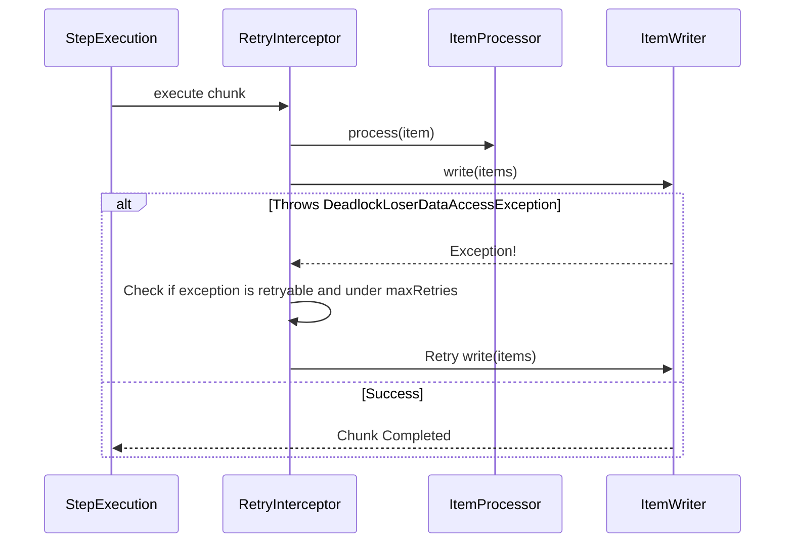

# Chapter 11 - Retry

## Introduction
Batch processing lo konni sarlu intermittent errors vastuntayi. Ee errors ni immediate ga fail chesekante, koncham sepu aagi malli try cheste (retry) success ayye chances untayi. Network glitch leda database deadlock vachinapudu ventane job fail avvakunda undadaniki retry mechanism chala help avtundi.

Spring Batch 6.0 lo okappudu unna `Spring Retry` library ni theesesi, **Spring Framework 7.0 core retry feature** tho automate chesaru. Ee chapter lo Retry gurinchi simple ga discuss cheddamu.

---

## 1. Retry in Action

Retry logic ekkuvaga external web service calls (network latency valla) leda concurrent database updates (deadlocks valla) jarigetappudu vadatharu. Example ga `DeadlockLoserDataAccessException` vaste ventane fail cheseyakunda malli attempt cheyadam best practice.

### Behind the Scenes: Core Retry Feature
*   **Version Specific Note:** *Since Spring Batch 6.0*, `spring-retry` is dropped, and `org.springframework.util.backoff.BackOff` along with Spring Framework 7.0 resilience APIs are used.
*   **How it applies in Step:** Meeru step builder lo `.faultTolerant()` configure chesinapudu, Spring Batch lopaliki interceptors ni inject chestundi. Oka exception throw ayinapudu, adhi retryable exception aa kada ani check chestundi. Ayithe, transaction ni malli retry chestundi.



### Code Example
```java
@Bean
public Step step1(JobRepository jobRepository, PlatformTransactionManager transactionManager) {
    // retry policy configuration
    int retryLimit = 3;
    var retryableExceptions = Set.of(DeadlockLoserDataAccessException.class);

    // Core Spring Framework 7.0 RetryPolicy
    RetryPolicy retryPolicy = RetryPolicy.builder()
        .maxRetries(retryLimit)
        .includes(retryableExceptions)
        .build();

    return new StepBuilder("step1", jobRepository)
                .<String, String>chunk(2, transactionManager)
                .reader(itemReader())
                .writer(itemWriter())
                .faultTolerant() // Mandatory for Retry/Skip
                .retryPolicy(retryPolicy)
                .build();
}
```


## Stateful vs Stateless Retry
- **Stateless Retry:** Typically used for external web service calls where there is no transactional boundary tied to the caller. The retry loop stays inside the current method call and just blocks until retries are exhausted.
- **Stateful Retry:** Used when transactional resources are involved. If a database insert fails and rolls back the transaction, a simple `while` loop won't work because the transaction is dead. The framework must bubble up the exception, rollback, and re-present the original item to the step in a brand-new transaction. Spring Batch manages this state inherently when chunk-oriented processing is used.

### Best Practices
- **Idempotency:** Retry logic vadetappudu `ItemProcessor` and `ItemWriter` idempotent ga undali. Endukante transaction fail ayyi rollback ayyaka malli same data ni process chestunnam.
- **Don't Retry Everything:** File parsing lanti deterministic errors (e.g. `FlatFileParseException`) ki retry panikiradu. Aa record same file lo enni sarlu chadhivina format thappugane untundi. Alanti vatiki **Skip** vadali. Retry is strictly for transient/intermittent failures.

## Summary
Retry anedi chala chinnadi kani powerful feature. Transient errors vaste job ni kapadukotaniki Spring Batch 6.0 kotha Spring Framework 7 resilience module ni vadi retry ni implement chestundi. Next chapter lo `Unit Testing` gurinchi thelusukundam.
