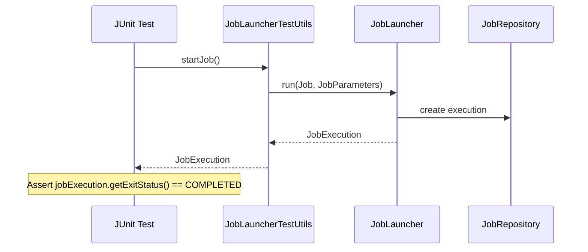

# Chapter 12 - Unit Testing

## Introduction
Prathi enterprise application ki testing anedi entha mukhyamo batch jobs ki kuda anthe mukhyam. Endukante batch jobs pedda data set meeda run avtayi, production lo fail ayithe chala ekuva damage jarigutundi. Spring Batch testing ni facilitate cheyadaniki `spring-batch-test` ane framework module ni isthundi. Ee chapter lo batch jobs ni "end-to-end" ga ela test cheyali, individual steps ni ela test cheyali, inka Step-scoped components ni ela mock cheyalo chusthamu.

*Since Spring Batch 6.0, JUnit 4 is no longer supported. Migration to JUnit Jupiter (JUnit 5) is recommended.*

---

## 1. Creating a Unit Test Class

Batch job ni test cheyali ante, thappakunda Job's `ApplicationContext` ni load cheyali. Deeni kosam Spring Batch rendu annotations ni istundi.

- `@SpringJUnitConfig`: Idi Spring context ni initialize chestundi.
- `@SpringBatchTest`: Idi Spring Batch test utilities ayina `JobLauncherTestUtils` mariyu `JobRepositoryTestUtils` ni test context loki inject chestundi.

```java
@SpringBatchTest
@SpringJUnitConfig(SkipSampleConfiguration.class)
public class SkipSampleFunctionalTests {
    // Test logic goes here
}
```

---

## 2. End-To-End Testing of Batch Jobs

End-to-End testing ante, oka job start avvadaniki mundu data prepare chesi, job ni start chesi, last ki output data expect chesinattu vachinda leda ani test cheyadam.

### Behind the Scenes: `JobLauncherTestUtils`
*   **Package Name:** `org.springframework.batch.test.JobLauncherTestUtils`
*   **Important Methods:** `startJob()`, `startJob(JobParameters)`, `startStep(String stepName)`
*   **Who calls it internally:** Mee JUnit `@Test` method call chestundi.
*   **What it calls next:** `JobLauncher.run()` ni internal ga call chesi Job ni trigger chestundi.
*   **Lifecycle:** Test class initialize avvagane `@SpringBatchTest` dwara idi inject avtundi. Job execute ayyaka `JobExecution` ni return chestundi (for assertions).



**Code Example:**
```java
@SpringBatchTest
@SpringJUnitConfig(SkipSampleConfiguration.class)
public class SkipSampleFunctionalTests {

    @Autowired
    private JobLauncherTestUtils jobLauncherTestUtils;

    @Autowired
    private JdbcTemplate jdbcTemplate;

    @Test
    public void testJob(@Autowired Job job) throws Exception {
        // 1. Setup Test Data
        this.jobLauncherTestUtils.setJob(job);
        this.jdbcTemplate.update("delete from CUSTOMER");
        this.jdbcTemplate.update("insert into CUSTOMER values (1, 'customer1')");

        // 2. Execute Job
        JobExecution jobExecution = jobLauncherTestUtils.startJob();

        // 3. Verify Result
        Assert.assertEquals("COMPLETED", jobExecution.getExitStatus().getExitCode());
    }
}
```

---


## Important Note on JobLauncherTestUtils
`JobLauncherTestUtils` is the utility class provided by Spring Batch to easily test jobs and steps end-to-end. It differs from `JobOperator` in that it is specifically designed for integration testing environments and automatically resolves the `Job` bean from the test context if there is only one.

## 3. Testing Individual Steps

Pedda jobs unte, motham job ni every time end-to-end test cheyadam kante, specific "Step" ni test cheyadam best.

```java
// Testing only one step instead of the entire job
JobExecution jobExecution = jobLauncherTestUtils.startStep("loadFileStep");
Assert.assertEquals("COMPLETED", jobExecution.getExitStatus().getExitCode());
```

---

## 4. Testing Step-Scoped Components

`@StepScope` unna components (e.g. `ItemReader` with late binding) standalone ga test cheyadam kastam. Endukante, avi initialize avvalante context lo `StepExecution` active ga undali.

Deeni kosam Spring Batch `StepScopeTestUtils` mariyu `StepScopeTestExecutionListener` isthundi. `@SpringBatchTest` unte e listener automatically add aipothundi.

**Mocking Execution Context Example:**
```java
@SpringBatchTest
@SpringJUnitConfig
public class StepScopeTestExecutionListenerIntegrationTests {

    @Autowired
    private ItemReader<String> reader;

    // This method sets up a fake StepExecution context for the Step-scoped components
    public StepExecution getStepExecution() {
        StepExecution execution = MetaDataInstanceFactory.createStepExecution();
        execution.getExecutionContext().putString("input.data", "foo,bar,spam");
        return execution;
    }

    @Test
    public void testReader() {
        // Because of StepScopeTestExecutionListener, the context is active and reader reads!
        assertNotNull(reader.read());
    }
}
```

Leda explicitly programmatic ga `StepScopeTestUtils` vadi cheyyochu:
```java
int count = StepScopeTestUtils.doInStepScope(stepExecution, () -> {
    int c = 0;
    while (reader.read() != null) { c++; }
    return c;
});
```

---

## 5. Mocking Domain Objects

Oka `StepExecutionListener` ni test cheyali ante, meeru dummy `StepExecution`, `JobExecution`, `JobInstance` create cheyalsi vastundi. Idi chala verbose (ekuva lines of code).

Daanikosam `MetaDataInstanceFactory` vadochu.
*   **Package Name:** `org.springframework.batch.test.MetaDataInstanceFactory`

```java
// Instead of huge object nesting, just use the factory:
StepExecution stepExecution = MetaDataInstanceFactory.createStepExecution();
stepExecution.setExitStatus(ExitStatus.COMPLETED);
stepExecution.setReadCount(0);

ExitStatus exitStatus = testedListener.afterStep(stepExecution);
assertEquals(ExitStatus.FAILED.getExitCode(), exitStatus.getExitCode());
```

---

## Interview Questions
1. **Spring Batch jobs ni unit test chestunapudu `@SpringBatchTest` enduku vadatharu?**
   - Idi test context loki Spring Batch utilities like `JobLauncherTestUtils` inka `StepScopeTestExecutionListener` lanti vatini inject chestundi. Deeni valla jobs ni leda step-scoped components ni test cheyadam easy avtundi.
2. **`@StepScope` unna reader/writer ni ela test chestaru?**
   - Direct ga test cheste `ScopeNotActiveException` vastundi. Daaniki dummy `StepExecution` theeskuni `StepScopeTestUtils.doInStepScope()` lona run cheyali leda test class paina `@SpringBatchTest` petti `getStepExecution()` method dwara fake context ni pass cheyali.

## Summary
Ee chapter lo Spring Batch tests rasetapudu unde complex requirements gurinchi (like mocking contexts, step level execution, end to end validation) chusamu. `JobLauncherTestUtils` and `MetaDataInstanceFactory` lanti tools developer productivity ni chala perugutayi. Next chapter lo manam Common Batch Patterns gurinchi thelusukundam.