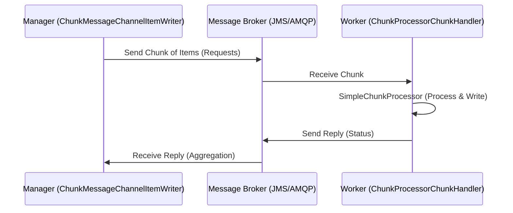
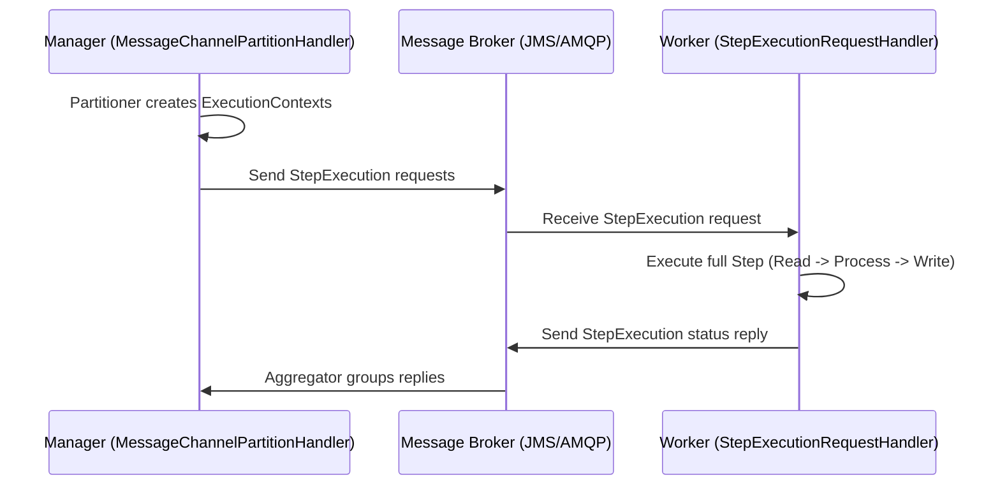
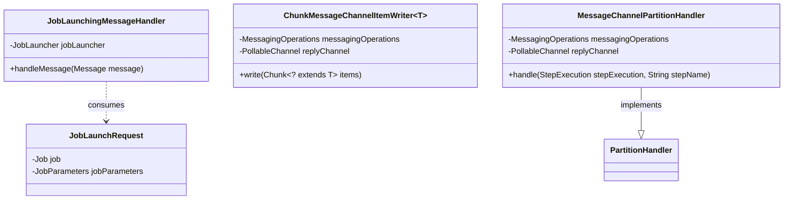

# Chapter 14: Spring Batch Integration

## Introduction
Spring Batch core provides features to process large volumes of data using local resources. Kani enterprise applications lo, external systems nunchi trigger ayye events base chesukoni jobs start cheyyadam, leda heavy processing ni multiple external workers ki offload cheyyadam chala common. Ikkada **Spring Batch Integration** (SBI) picture loki vastundi. Spring Batch and Spring Integration kalipi use cheyadam valla, decouple aina, message-driven, and highly scalable batch processing architectures ni build cheyachu.

## Why this feature exists
- **Event-Driven Execution**: File system lo kotha file vasthe automatic ga job launch avvali (using `File Inbound Channel Adapter`).
- **Feedback & Notifications**: Job or Step complete ayyaka email notification or SMS pampali (using Gateway as `StepExecutionListener`).
- **Asynchronous Processing**: Chunk processing lo prathi item ni asynchorous ga process chesi, all items processing complete ayyaka matrame write cheyyali.
- **Distributed Processing (Externalizing Execution)**: Single JVM lo processing power sariponappudu, processing ni messaging middleware (JMS, AMQP) use chesi multiple external JVMs (workers) ki distribute cheyyali (Remote Chunking, Remote Partitioning).

---

## 1. Launching Batch Jobs through Messages
Manam usually `JobOperator` or `JobLauncher` use chesi programmatic ga or cron-jobs tho jobs ni start chestham. Kani Spring Integration use cheste, event-driven ga job launch cheyochu.

### Core Concept
Spring Batch Integration `JobLaunchingMessageHandler` class ni provide chestundi. Idi Spring Integration channel nunchi `JobLaunchRequest` (which wraps `Job` and `JobParameters`) ni receive chesukoni batch job ni launch chestundi. Job launch ayyaka, `JobExecution` instance ni reply channel ki pampistundi.

### Transforming a File to JobLaunchRequest
Oka directory lo file CSV drop avvagane job launch avvali anukondi:

```java
import org.springframework.batch.core.Job;
import org.springframework.batch.core.JobParametersBuilder;
import org.springframework.batch.integration.launch.JobLaunchRequest;
import org.springframework.integration.annotation.Transformer;
import org.springframework.messaging.Message;
import java.io.File;

public class FileMessageToJobRequest {
    private Job job;
    private String fileParameterName;

    // Setters for job and fileParameterName

    @Transformer
    public JobLaunchRequest toRequest(Message<File> message) {
        JobParametersBuilder jobParametersBuilder = new JobParametersBuilder();
        jobParametersBuilder.addString(fileParameterName, message.getPayload().getAbsolutePath());
        return new JobLaunchRequest(job, jobParametersBuilder.toJobParameters());
    }
}
```


## The JobExecution Response
JobLaunchingGateway job ni execute cheyagane `JobExecution` instance return avtundi.
Kani ikkada catch enti ante, `TaskExecutor` behaviour meeda idi depend ayyi untundi.
- Single-threaded (Sync) `TaskExecutor` vadithe, job completely finish ayye daka gateway block ayyi, last ki response isthundi.
- Asynchronous `TaskExecutor` vadithe, `JobExecution` ventane (job inka run avthundagane) return aipothundi. Appudu manam `JobExplorer` vadi status poll cheskovali.

### Configuration Using JobLaunchingGateway
Java configuration dwara gateway ni define cheyadam:

```java
@Bean
public JobLaunchingGateway jobLaunchingGateway(JobRepository jobRepository) {
    TaskExecutorJobLauncher jobLauncher = new TaskExecutorJobLauncher();
    jobLauncher.setJobRepository(jobRepository);
    jobLauncher.setTaskExecutor(new SyncTaskExecutor());
    return new JobLaunchingGateway(jobLauncher);
}

@Bean
public IntegrationFlow integrationFlow(JobLaunchingGateway jobLaunchingGateway) {
    return IntegrationFlow.from(Files.inboundAdapter(new File("/tmp/myfiles"))
                    .filter(new SimplePatternFileListFilter("*.csv")),
            c -> c.poller(Pollers.fixedRate(1000).maxMessagesPerPoll(1)))
            .transform(fileMessageToJobRequest())
            .handle(jobLaunchingGateway) // Passes JobLaunchRequest to JobLaunchingGateway
            .log(LoggingHandler.Level.WARN, "headers.id + ': ' + payload") // Logs JobExecution
            .get();
}
```

**Note:** `JobExecution` return behaviour TaskExecutor meeda depend ayyi untundi. `SyncTaskExecutor` use cheste job complete ayyaka return avtundi. Asynchronous TaskExecutor aite ventane return avtundi.

---

## 2. Providing Feedback with Informational Messages
Batch jobs long-running aite, intermediate progress meeda notifications pampadam chala important. `StepExecutionListener`, `ChunkListener`, and `JobExecutionListener` ni Spring Integration Gateways laaga act chesela configure cheyochu.

```java
@MessagingGateway(name = "notificationExecutionsListener", defaultRequestChannel = "stepExecutionsChannel")
public interface NotificationExecutionListener extends StepExecutionListener {}

@Bean
@ServiceActivator(inputChannel = "stepExecutionsChannel")
public LoggingHandler loggingHandler() {
    LoggingHandler adapter = new LoggingHandler(LoggingHandler.Level.WARN);
    adapter.setLoggerName("TEST_LOGGER");
    adapter.setLogExpressionString("headers.id + ': ' + payload");
    return adapter;
}
```

Job config lo Step build chese appudu e listener ni inject cheyali.

---

## 3. Asynchronous Processors
`ItemProcessor` lo heavy logic (like remote API calls) unte chunk processing slow avthundi. Asynchronous processors fork-join approach ni implement chestayi. `AsyncItemProcessor` item ni separate thread lo process chesi `Future` ni return chestundi. `AsyncItemWriter` aa futures anni resolve ayyedaaka wait chesi, taravata actual `ItemWriter` ki list of results ni pampistundi.

```java
@Bean
public AsyncItemProcessor<Person, Person> asyncProcessor(ItemProcessor<Person, Person> delegate, TaskExecutor taskExecutor) {
    AsyncItemProcessor<Person, Person> processor = new AsyncItemProcessor<>();
    processor.setDelegate(delegate);
    processor.setTaskExecutor(taskExecutor);
    return processor;
}

@Bean
public AsyncItemWriter<Person> asyncWriter(ItemWriter<Person> delegate) {
    AsyncItemWriter<Person> writer = new AsyncItemWriter<>();
    writer.setDelegate(delegate);
    return writer;
}
```

---

## 4. Externalizing Batch Process Execution
Spring Batch internally Spring Integration ni vaadi processing ni multiple JVMs loki scale cheyagaladu. Ikkada main ga rendu concepts unnayi: **Remote Chunking** & **Remote Partitioning**.

### A) Remote Chunking
Ikkada read cheyadam Manager lo jaruguthundi. Processing (heavy) ni message queue dwara remote workers ki pampistundi. Vachina processed data ni writer dwara malli raayachu.



**Manager Setup (`@EnableBatchIntegration` tho):**
```java
@Autowired
private RemoteChunkingManagerStepBuilderFactory managerStepBuilderFactory;

@Bean
public TaskletStep managerStep() {
    return this.managerStepBuilderFactory.get("managerStep")
               .chunk(100)
               .reader(itemReader())
               .outputChannel(requests()) // sending to workers
               .inputChannel(replies())   // receiving from workers
               .build();
}
```

**Worker Setup:**
```java
@Autowired
private RemoteChunkingWorkerBuilder workerBuilder;

@Bean
public IntegrationFlow workerFlow() {
    return this.workerBuilder
               .itemProcessor(itemProcessor())
               .itemWriter(itemWriter())
               .inputChannel(requests()) // receiving from manager
               .outputChannel(replies()) // sending to manager
               .build();
}
```
*Note: Remote Chunking lo Manager network IO bottleneck ayye chance undi endukante anni records oka JVM lonche read avvali.

### B) Remote Partitioning
Remote Partitioning lo read, process, and write moodu worker lone jaruguthayi. Manager just "metadata" (Partition parameters) matrame queue dwara workers ki istundi. Idi I/O heavy jobs ki best.



**Manager Setup:**
```java
@Autowired
private RemotePartitioningManagerStepBuilderFactory managerStepBuilderFactory;

@Bean
public Step managerStep() {
     return this.managerStepBuilderFactory.get("managerStep")
        .partitioner("workerStep", partitioner())
        .gridSize(10)
        .outputChannel(outgoingRequestsToWorkers())
        .inputChannel(incomingRepliesFromWorkers()) // Aggregation kosam
        .build();
}
```

**Worker Setup:**
```java
@Autowired
private RemotePartitioningWorkerStepBuilderFactory workerStepBuilderFactory;

@Bean
public Step workerStep() {
     return this.workerStepBuilderFactory.get("workerStep")
        .inputChannel(incomingRequestsFromManager())
        .outputChannel(outgoingRepliesToManager())
        .chunk(100)
        .reader(itemReader())
        .processor(itemProcessor())
        .writer(itemWriter())
        .build();
}
```

---

## Behind the Scenes: Core Components (The 7-Point Technical Deep Dive)

### 1. Fully Qualified Package Names
- `JobLaunchingMessageHandler`: `org.springframework.batch.integration.launch.JobLaunchingMessageHandler`
- `JobLaunchRequest`: `org.springframework.batch.integration.launch.JobLaunchRequest`
- `AsyncItemProcessor`: `org.springframework.batch.integration.async.AsyncItemProcessor`
- `ChunkMessageChannelItemWriter`: `org.springframework.batch.integration.chunk.ChunkMessageChannelItemWriter`
- `MessageChannelPartitionHandler`: `org.springframework.batch.integration.partition.MessageChannelPartitionHandler`

### 2. Primary Purpose
Spring Batch local execution JVM nunchi bayataki thechi distributed, message-driven cloud-native environment loki teeskelladame Spring Batch Integration primary purpose.

### 3. Default Implementations / Flow
Remote Chunking Flow:
- `ChunkMessageChannelItemWriter#write()` -> Message payload lo items list create chestundi.
- `MessagingTemplate` use chesi outbound channel ki pampistundi.
- Remote lo `ChunkProcessorChunkHandler#handleChunk()` call avthundi.
- Akkada `SimpleChunkProcessor` execute ayyi, result status message roopam lo venakki vastundi.

### 4. Code Execution Flow (Source Code Path)
```text
(Spring Integration Poller / Inbound Adapter)
 -> FileMessageToJobRequest#toRequest()
 -> JobLaunchingMessageHandler#handleMessage()
 -> TaskExecutorJobLauncher#run()
 -> (Batch Job Executes)
 -> JobLaunchingMessageHandler returns JobExecution payload to reply channel.
```

### 5. Architectural Relationships (Mermaid Class Diagram)


### 6. Common Best Practices
- **Use Partitioning over Chunking**: Network meeda massive data thippakunda (Remote chunking problem), just instruction pampi worker daggarane I/O cheyinchadam (Remote partitioning) chala better performance isthundi.
- **Async Execution with Proper Pools**: `AsyncItemProcessor` vaadetappudu properly sized `ThreadPoolTaskExecutor` (bounded queue tho) vaadali, lekapothe OutOfMemory errors vache chance undi.

### 7. Common Mistakes
- **Reply Channel Timeouts**: Gateway or Partition handler lo `receiveTimeout` pettakapothe, remote worker fail aina or broker down unna, manager indefinitely block aipotundi. Always set timeouts.
- **Not implementing Serializable**: Remote chunking lo queue meedaki objects veltunnayi ante, mi custom Domain Objects and DTOs కచ్చితంగా `Serializable` ni implement cheyyali.

---

## Interview Questions

1. **Spring Batch Integration Enduku Use Chestharu?**
   **Ans:** Events dwara (like file arriving in a folder) batch jobs ni launch cheyadaniki, jobs ni remote worker nodes loki distribute cheyadaniki (Remote chunking, Remote partitioning), and batch events ni messaging queues ki push cheyadaniki (monitoring/alerts).

2. **Remote Chunking vs Remote Partitioning ki theda enti?**
   **Ans:** Remote Chunking lo Manager okkade Data ni DB or File nunchi chadhuvthadu, items ni chunks laaga chesi RabbitMQ/ActiveMQ dwara worker ki pampistadu. Process and Write matrame worker chesthadu. Idi processor-heavy unte panikostundi.
   Remote Partitioning lo Manager just 'range/metadata' pampistadu. Worker ah metadata theesukoni thana sontha Reader dwara I/O operations chesthadu. Idi I/O heavy situations ki scale avvadaniki chala best.

3. **`AsyncItemProcessor` and `AsyncItemWriter` ela pani chesthayi?**
   **Ans:** `AsyncItemProcessor` items ni thread pool nunchi fetch chesina kotha thread lo execute chesi `Future` ni isthundi. `AsyncItemWriter` ah futures complete ayyedaaka wait chesi, taruvata bulk ga actual synchronous `ItemWriter` ki list ni delegate chestundi.

4. **Spring Batch Integration lo Job Launch Gateway parameters enti?**
   **Ans:** `request-channel`, `reply-channel`, `reply-timeout`, and `job-launcher`.
