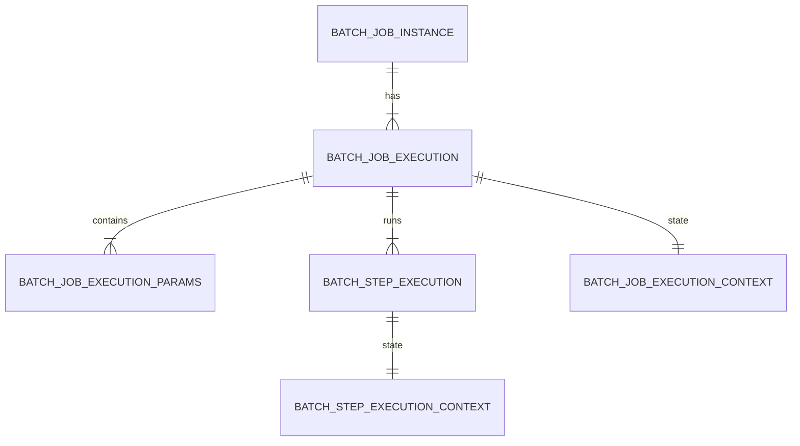

# Chapter 17 - Appendix: Meta-Data Schema

## Introduction
Spring Batch okka framework ga restart, retry, stat tracking lantivi provide chestundi ante daniki main reason daani backend lo unde metadata tables. Spring Batch lo unna Java domain objects anni directly database tables ki map avthayi. Ee chapter lo ah schema lo emuntundi, columns enduku ala design chesaru ani detail ga chuddam.

## Why this feature exists
Batch processing lo job failures sangathe thelisindhe. "Ekkuva data unnappudu madhyalo fail aite, ekkada aagipoindo thelusukuni akkadinunche malli ela start avvali?" ane prashnaki samadhanam ee metadata tables. Ivi Job and Step state ni persist chesthayi.

## DDL Scripts and Migrations
Spring Batch `core` JAR file lo standard DDL scripts untayi. Ivi `/org/springframework/batch/core/schema-*.sql` location lo dorukutayi.
Adhe vidhanga, paatha versions nunchi kotha versions ki upgrade ayyetappudu avasaramaina schema modifications kosam `migration` folder lo version specific scripts kooda istharu.

## Multi-byte Character Support
Chinese leda Telugu Unicode lanti multi-byte characters ni `JobRepository` lo store cheyali ante, table schema lo `VARCHAR` length ni double cheyali leda `NVARCHAR` vadali. Spring Batch `JobRepository` properties lo `max-varchar-length` ni half ki set cheste data truncation lekunda chusukuntundi.

---

## 1. Overview of Meta-Data Tables

Java domain objects ki, relational tables ki direct mapping undi:

- `JobInstance` → `BATCH_JOB_INSTANCE`
- `JobExecution` → `BATCH_JOB_EXECUTION`
- `JobParameters` → `BATCH_JOB_EXECUTION_PARAMS`
- `StepExecution` → `BATCH_STEP_EXECUTION`
- `ExecutionContext` (Job-level) → `BATCH_JOB_EXECUTION_CONTEXT`
- `ExecutionContext` (Step-level) → `BATCH_STEP_EXECUTION_CONTEXT`

---

## 2. Important Design Concepts

### Version (Optimistic Locking)
Maximum tables lo `VERSION` ane column untundi. Ee column ni Spring Batch optimistic locking kosam vaadutundi. Oka table row ni batch job update chesinappudalla, ee `VERSION` column count +1 peruguthundi. Okesaari iddaru e row ni update cheyadaniki try cheste, version miss-match ayyi `OptimisticLockingFailureException` vastundi. Idi concurrent execution bugs ni aputhundi.

### Identity (Sequences)
`BATCH_JOB_INSTANCE`, `BATCH_JOB_EXECUTION`, and `BATCH_STEP_EXECUTION` tables ki `_ID` suffix tho primary keys untayi. Kani ivi auto-increment keys kaadu. Endukante, DB nunchi key mundhe thecchukuni Java object meeda set cheste gani insert avvadu. Andhuke separate sequences vaadatharu:
- `BATCH_JOB_INSTANCE_SEQ`
- `BATCH_JOB_EXECUTION_SEQ`
- `BATCH_STEP_EXECUTION_SEQ`

MySQL lanti db lu sequences ni support cheyavu kabatti, Spring Batch vaatiki tables vaadi value ni increment chestundi (`MySQLMaxValueIncrementer`).

---

## 3. Table Details

### The BATCH_JOB_INSTANCE Table
Idi hierarchy ki top lo untundi. Job okasaari submit ayite ikkada record create avtundi.
- `JOB_INSTANCE_ID`: Primary Key.
- `JOB_NAME`: Job peru (e.g., "endOfDayJob").
- `JOB_KEY`: Job parameter values nunchi generate ayina unique hash. (Job name + Job Key kalipi unique ga undali).

### The BATCH_JOB_EXECUTION_PARAMS Table
Job ki pass chesina parameters ni store chestundi. Deniki primary key undadu endukante framework ki daani avasaram ledu.
- `PARAMETER_NAME`: Parameter key (e.g., "run.date").
- `PARAMETER_TYPE`: String, Long, Double, Date.
- `PARAMETER_VALUE`: Actual value.
- `IDENTIFYING`: Idi `true` aithe ne ee parameter job identity (JOB_KEY) generation lo participate chestundi.

### The BATCH_JOB_EXECUTION Table
Oka `JobInstance` ni run chesinappudalla oka Execution record create avtundi. Failed job ni malli run cheste kottha `JobExecution` create avtundi but `JobInstance` paatadhe untundi.
- `START_TIME` / `END_TIME`: Execution bounds.
- `STATUS`: Execution status (STARTED, COMPLETED, FAILED).
- `EXIT_CODE` / `EXIT_MESSAGE`: Job aagipoyinappudu command-line status and error details untayi.

### The BATCH_STEP_EXECUTION Table
Step level execution details. Job execution ki entha important oo, step ki idi antha important. Ee table lo monitoring and stat tracking data antha untundi.
- `COMMIT_COUNT`: Enni sarlu transaction commit ayyindi.
- `READ_COUNT`, `FILTER_COUNT`, `WRITE_COUNT`: Item processing counts.
- `READ_SKIP_COUNT`, `WRITE_SKIP_COUNT`, `PROCESS_SKIP_COUNT`: Enni items skip ayyayi (fault tolerance appudu).
- `ROLLBACK_COUNT`: Enni sarlu transactions rollback ayyayi.

### The BATCH_JOB_EXECUTION_CONTEXT and BATCH_STEP_EXECUTION_CONTEXT Tables
Job and Step level execution states ni store chesthayi. Job fail ayyi restart ayinappudu, "last ekkada aagipoyamu" anna data (like read count, file line number) ikkadnunche teeskuntundi.
- `SHORT_CONTEXT`: Context loni chinna text.
- `SERIALIZED_CONTEXT`: Porthi context ni JSON (ledo Base64 serialized objects) laaga CLOB lo save chestundi.

---

## 4. Archiving & Indexing

Prathi job run ayinappudu ee tables lo data add avthu velthundi. Kabatti production lo old data ni remove (archive) cheyadam chala common.
Kani data delete chese mundu oka rule marchipokudadu: "Failed state lo unna Job instance/execution data delete cheste, framework adhi fresh run anukuni first nunchi run chestundi". Complete ayyina vatine archive cheyali.

Spring batch indexing isvadu, kani mana load base cheskoni maname index cheskovali. Important where clauses:
- `BATCH_JOB_INSTANCE`: `JOB_NAME = ? and JOB_KEY = ?` (Job launch appudu)
- `BATCH_JOB_EXECUTION`: `JOB_INSTANCE_ID = ?` (Job restart appudu)
- `BATCH_STEP_EXECUTION`: `STEP_NAME = ? and JOB_EXECUTION_ID = ?` (Step start mundhu)

---

## Interview Questions
1. **Spring Batch metadata tables lo `VERSION` column upayogam enti?**
   **Ans:** Optimistic Locking kosam. Multiple servers nunchi oke saari okate database meeda okate job instance status update avvakunda prevent cheyadaniki.

2. **Spring Batch lo okavele Job fail ayyi malli start cheste table entires ela untayi?**
   **Ans:** Patha `BATCH_JOB_INSTANCE` ke kottha `BATCH_JOB_EXECUTION` (with new sequence id) and dani kinda kotha `BATCH_STEP_EXECUTION` records insert avthayi. ExecutionContext mathram pathadhe read cheskoni resume avthundi.

## Schema Upgrade Notes
Spring Batch versions update ayinappudu, e.g., 4 to 5 or 5 to 6, metadata schema lo konni columns size leda sequence names marutuntayi. Ee scripts `org/springframework/batch/core/schema-*.sql` kindha framework jar lo dhorukuthayi.
